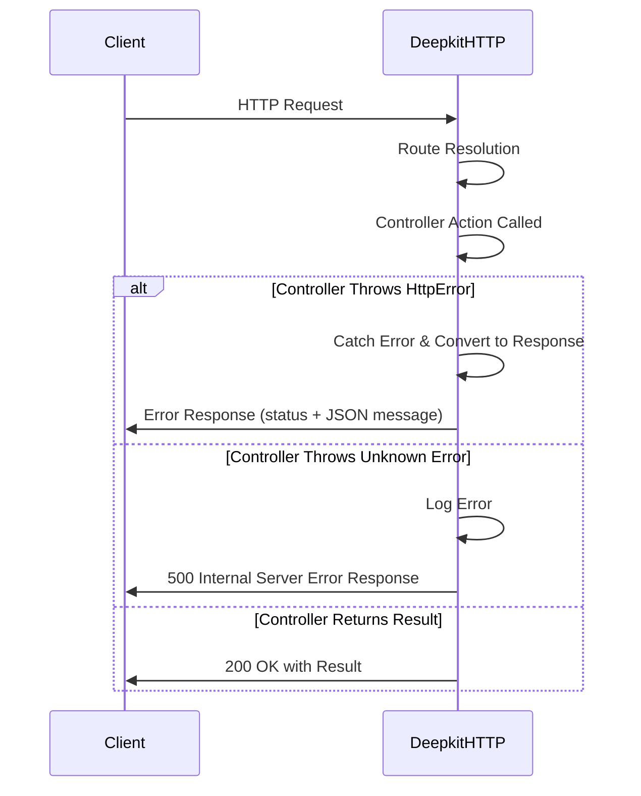

# HTTP Errors & Status Codes

This reference page details how Deepkit HTTP handles error responses, the standard HTTP status codes mapped in the framework, and ways you can customize or intercept errors in your Deepkit HTTP applications. Understanding these HTTP error classes and response codes empowers you to build robust and user-friendly APIs.

---

## 1. Built-in HTTP Error Classes

Deepkit provides a comprehensive set of built-in HTTP error classes that correspond directly to standard HTTP status codes. These error classes can be thrown within your HTTP controllers or functional routes to return appropriate HTTP responses automatically.

Here is a list of common HTTP error classes included in Deepkit:

| Error Class                | HTTP Status Code | Description           |
|----------------------------|------------------|-----------------------|
| `HttpBadRequestError`       | 400              | Bad Request           |
| `HttpUnauthorizedError`     | 401              | Unauthorized          |
| `HttpAccessDeniedError`     | 403              | Access Denied         |
| `HttpNotFoundError`         | 404              | Not Found             |
| `HttpMethodNotAllowedError` | 405              | Method Not Allowed    |
| `HttpNotAcceptableError`    | 406              | Not Acceptable        |
| `HttpTimeoutError`          | 408              | Request Timeout       |
| `HttpConflictError`         | 409              | Conflict              |
| `HttpGoneError`             | 410              | Gone                  |
| `HttpTooManyRequestsError`  | 429              | Too Many Requests     |
| `HttpInternalServerError`   | 500              | Internal Server Error |
| `HttpNotImplementedError`   | 501              | Not Implemented       |

These errors are subclasses of `HttpError<T>` where `T` is the HTTP status code.

### Throwing a Built-in HTTP Error

You can simply raise these errors inside your controller or route to send an error response:

```typescript
import { HttpNotFoundError } from '@deepkit/http';

class UserController {
  @http.GET('/user/:id')
  async getUser(id: number) {
    const user = await this.database.query(User).filter({ id }).findOneOrUndefined();
    if (!user) throw new HttpNotFoundError('User not found');
    return user;
  }
}
```

When thrown, Deepkit catches the error and converts it into a proper JSON response with the `httpCode` and message.

## 2. Creating Custom HTTP Errors

If you need HTTP errors beyond the built-ins, Deepkit enables you to define custom HTTP errors easily by extending the `createHttpError()` function.

```typescript
import { createHttpError } from '@deepkit/http';

export class HttpPreconditionFailedError extends createHttpError(412, 'Precondition Failed') {}

// Usage
throw new HttpPreconditionFailedError('Etag mismatch');
```

This flexibility helps you to provide clear error semantics in your API responses.

## 3. How Deepkit Handles Errors Internally

Deepkit HTTP's internal workflow listens to exceptions thrown during route handling, serialization, and parameter resolving. It converts thrown errors matching `HttpError` subclasses into JSON responses with the matching status code and message. Validation errors and serialization errors are also converted accordingly.

If an unknown error or non-HTTP error is thrown, Deepkit will respond with a generic 500 Internal Server Error and log the error details.

### Example Error Response

```json
{
  "message": "User not found"
}
```

with HTTP status code 404 for `HttpNotFoundError`.

## 4. Customizing Error Handling

You can customize how errors are transformed before being sent to the client by intercepting the HTTP workflow events or overriding `transformError` behavior in custom kernels.

For example, you can listen to controller errors and return custom responses:

```typescript
import { httpWorkflow, HtmlResponse } from '@deepkit/http';

app.listen(httpWorkflow.onControllerError, (event) => {
  if (event.error instanceof HttpNotFoundError) {
    event.send(new HtmlResponse('<h1>Page not found</h1>', 404));
  } else {
    event.send(new HtmlResponse('<h1>Internal Server Error</h1>', 500));
  }
});
```

This allows you to return HTML, redirect, or any other response instead of the default JSON error.

## 5. Using HTTP Error Classes in Middleware

HTTP errors can also be thrown in middlewares to interrupt request processing with the correct HTTP status code.

```typescript
import { HttpUnauthorizedError, HttpMiddleware, HttpRequest, HttpResponse } from '@deepkit/http';

class AuthMiddleware implements HttpMiddleware {
  async execute(request: HttpRequest, response: HttpResponse, next: (err?: any) => void) {
    if (!request.headers.authorization) {
      throw new HttpUnauthorizedError('Missing authorization token');
    }
    next();
  }
}
```

## 6. Common Pitfalls and Tips

- **Always throw errors** rather than returning error objects; Deepkit's HTTP workflow expects exceptions.
- **Use the built-in error classes** for standard HTTP responses to ensure consistent status codes.
- **Customize error messages carefully** to avoid leaking sensitive data.
- When creating custom errors, **register them properly if they are forwarded in RPC contexts** to preserve class identity.

---

## Summary Diagram: HTTP Error Flow



---

## 7. Related Topics

- [HTTP Controllers & Endpoints](./http-controllers) for defining routes
- [HTTP Request & Response Examples](../api-usage-examples/http-request-examples) for handling responses
- [API Error Handling & RPC Errors](../api-error-handling) for advanced error management


---

## Additional Resources

- Full list of Deepkit HTTP built-in error classes in [@deepkit/http source code](https://github.com/deepkit/deepkit-framework/blob/main/packages/http/src/http.ts)
- Related guide on [custom error handling patterns](./http-controllers#custom-error-handling)

---

Mastering HTTP error handling in Deepkit lets you deliver clear, precise feedback to your API consumers and maintain robust server operations.


---

