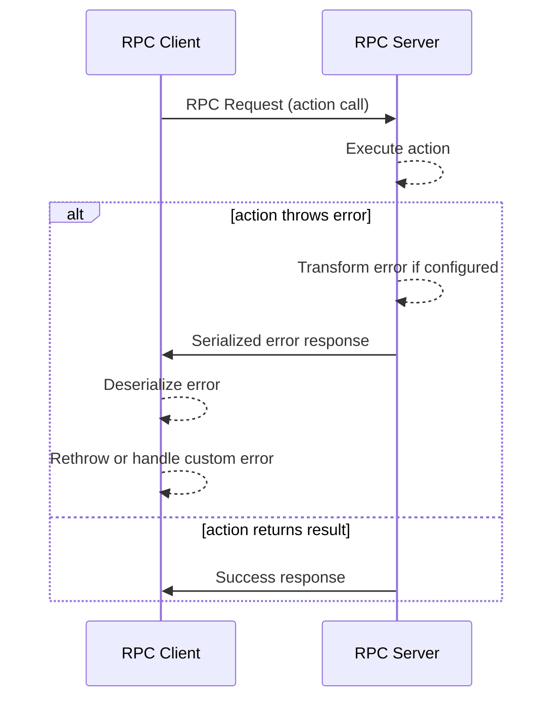

# RPC Error Patterns

Understanding error handling in Deepkit RPC is crucial for building robust, maintainable, and secure remote APIs. This page guides you through how errors are captured, serialized, forwarded, and transformed across RPC boundaries, ensuring clear debugging while maintaining control over sensitive information.

---

## 1. Overview of Error Forwarding

In Deepkit RPC, any error thrown inside an RPC action on the server is automatically serialized and sent back to the client. This serialization preserves key information such as the error message, the stack trace, and any additional properties defined in custom error classes.

This robust mechanism ensures that errors are not swallowed silently and can be handled appropriately on the client side — for example, providing meaningful feedback to users or triggering specific recovery workflows.

<!-- Storytelling context -->
Imagine you have a server API that fetches user profiles. If a user ID is invalid, your server throws an error. Deepkit RPC makes sure the client knows exactly what went wrong (not only that something failed), enabling precise error handling without manual glue code.

---

## 2. Using Custom Error Classes

To maintain rich error information and enable `instanceof` checks on the client, custom error classes must be registered as nominal types in the runtime. This is done using `@entity.name('@error:<unique-name>')` decorator.

### Example: Defining and Using a Custom Error

```typescript
import { entity } from '@deepkit/type';
import { rpc } from '@deepkit/rpc';

@entity.name('@error:myError')
class MyError extends Error {
    codes: string[] = [];
}

// Server-side controller
@rpc.controller('/main')
class Controller {
    @rpc.action()
    saveUser(user: any): void {
        throw new MyError('Cannot save user');
    }
}

// Client-side usage
// Note: Pass custom error class to controller for runtime recognition
const controller = client.controller<Controller>('/main', [MyError]);

try {
    await controller.saveUser({});
} catch (e) {
    if (e instanceof MyError) {
        console.log('Custom error caught with codes:', e.codes);
    } else {
        console.error('Generic error:', e.message);
    }
}
```

<Check>
Always decorate your custom error classes with `@entity.name('@error:<unique-name>')` and register them on the client controller to preserve error identity.
</Check>

---

## 3. Error Serialization Details

Deepkit RPC serializes errors by capturing:

- `classType`: Unique identifier string of the error class.
- `message`: The human-readable error message.
- `stack`: The stack trace for debugging.
- `properties`: Optional additional metadata attached to the error instance.

On the client side, errors are deserialized back into objects that maintain all these data, enabling handlers to access detailed error context.

### Built-in Error: `RpcError`

The framework provides a base error class `RpcError` that custom errors often extend for consistency.


---

## 4. Handling and Transforming Errors Securely

Because stacks and detailed error messages might reveal sensitive implementation details, Deepkit RPC allows you to customize error transformation.

You can override the `transformError` method of your `RpcKernelSecurity` implementation to sanitize or wrap errors before they are serialized and sent.

### Example: Custom Error Transformation

```typescript
import { RpcKernelSecurity } from '@deepkit/rpc';
import { Logger } from '@deepkit/logger';

class MyKernelSecurity extends RpcKernelSecurity {
    constructor(private logger: Logger) {
        super();
    }

    transformError(error: Error): Error {
        // Log the error internally
        this.logger.error('RPC Error occurred', error);

        // Return a generic error to avoid leaking internals
        return new Error('Internal server error: ' + error.message);
    }
}
```

<Tip>
Use error transformation especially when exposing RPC APIs to untrusted clients (e.g., browsers) to avoid information leaks.
</Tip>

<Warning>
Transforming errors into generic Error instances causes loss of stack traces and breaks `instanceof` checks on the client.
Use it judiciously.
</Warning>

---

## 5. Well-Known Error Codes in RPC

Deepkit RPC leverages error codes embedded within serialized error details to communicate specific failure scenarios across the client-server boundary.

Common known error classes and behaviors include:

- `RpcError`: General RPC errors internally used by the framework.
- `AuthenticationError`: Errors emitted during authentication failure.
- ValidationErrors: Errors from data validation failures with detailed field-level messages.

By inspecting these error objects on the client, you can implement precise error handling strategies.

---

## 6. Best Practices for RPC Error Handling

<AccordionGroup title="Best Practices">
<Accordion title="Use Explicit Error Types">
Use explicit, decorated custom error classes to clearly differentiate error causes and enable rich error handling workflows on clients.
</Accordion>
<Accordion title="Handle Expected vs Unexpected Errors Differently">
Gracefully catch validation and authentication errors with user feedback; log and alert for unexpected internal errors.
</Accordion>
<Accordion title="Keep Error Messages Concise for Clients">
Turn off verbose stack traces for public clients but preserve them in internal logs for debugging.
</Accordion>
<Accordion title="Always Register Custom Error Classes on Client">
Ensure you register your custom error classes when constructing client controllers to preserve instance identity.
</Accordion>
</AccordionGroup>

---

## 7. Troubleshooting Common Error Issues

<Tip>
If the client receives generic errors without class identities:
</Tip>

- Verify that your custom error classes are decorated with `@entity.name('@error:<unique-name>')`.
- Make sure the client registers those custom error classes with the controller import.

<Tip>
If sensitive error information is exposed to untrusted clients:
</Tip>

- Implement a strict `transformError` method in your `RpcKernelSecurity` to sanitize errors before they are sent.

<Tip>
For validation errors showing unexpected messages:
</Tip>

- Use Deepkit type validators with strict serialization enabled.
- Enable `logValidationErrors` on actions during development to get detailed logs.

---

## 8. Error Handling Flow Diagram



---

## 9. Additional References

- [RPC Getting Started Guide](./rpc-getting-started.md) — How to create controllers, actions, and set up the RPC server/client.
- [RPC Controllers & Actions](./rpc-controllers.md) — Deep dive into defining RPC controllers and method validations.
- [Runtime Types & Validation](../../concepts/data-modeling-and-validation/runtime-types-and-reflection.md) — Understanding type-driven validation and serialization.
- [Error Forwarding in RPC](./rpc/errors.md) — Practical examples and usage patterns.

---

By mastering these patterns, you ensure your Deepkit RPC APIs not only deliver high performance but also provide safe, transparent, and developer-friendly error handling across distributed boundaries.
