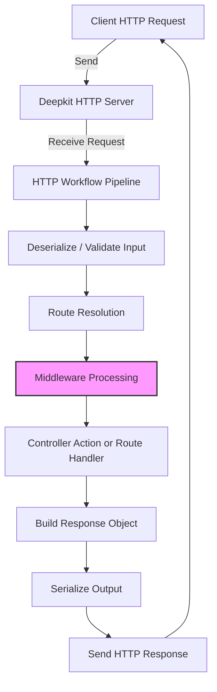

# HTTP Request & Response Examples

This page provides practical, real-world examples of HTTP requests and responses for common scenarios handled with Deepkit's HTTP Library. These examples demonstrate the shapes of request payloads, typical response formats, relevant status codes, and usage patterns of the Deepkit HTTP client and server SDKs, equipping you to build robust APIs with confidence.

---

## 1. Simple GET Request

### Use Case
Retrieve user data by ID, with validation ensuring the ID is a positive number.

### Request Example
```http
GET /user/42 HTTP/1.1
Host: example.com
Accept: application/json
```

### Functional API Example
```typescript
import { Positive } from '@deepkit/type';
import { http, HttpRouterRegistry } from '@deepkit/http';
import { FrameworkModule } from "@deepkit/framework";

const app = new App({ imports: [new FrameworkModule()] });
const router = app.get(HttpRouterRegistry);

router.get('/user/:id', (id: number & Positive, database: Database) => {
    // Deepkit ensures 'id' is a positive number automatically.
    return database.query(User).filter({ id }).findOne();
});

app.run();
```

### Response Example
```json
{
  "id": 42,
  "username": "johndoe",
  "email": "john@example.com"
}
```

### Notes
- The ID parameter is automatically deserialized and validated.
- Database service is injected by Deepkit’s DI container.
- Returns HTTP 200 if user exists; HTTP 404 if not found (throwing `HttpNotFoundError`).

---

## 2. POST Request with JSON Body

### Use Case
Create a new user by submitting a JSON payload with validation constraints.

### Request Example
```http
POST /user/register HTTP/1.1
Content-Type: application/json
Accept: application/json

{
  "username": "alice",
  "password": "secret123"
}
```

### Route Handler Example
```typescript
import { MaxLength, MinLength } from '@deepkit/type';
import { http, HttpBody } from '@deepkit/http';

interface UserRegistration {
    username: string & MinLength<3> & MaxLength<20>;
    password: string & MinLength<4>;
}

router.post('/user/register', (user: HttpBody<UserRegistration>) => {
    // Input is automatically deserialized and validated.
    return userService.createUser(user);
});
```

### Response Example
```json
{
  "success": true,
  "userId": 101
}
```

### Notes
- Using `HttpBody<T>` instructs Deepkit to deserialize JSON request body into type `T`.
- Validation constraints prevent invalid input (e.g., too short usernames).
- Validation errors automatically generate detailed client error responses.

---

## 3. Controller-Based Route Definition

### Use Case
Using class-based controllers for more structured API design and dependency injection.

### Controller Example
```typescript
import { http } from '@deepkit/http';

class UserController {
    constructor(private database: Database) {}

    @http.GET('/user/:id')
    getUser(id: number & Positive) {
        return this.database.query(User).filter({ id }).findOne();
    }

    @http.POST('/user')
    createUser(user: HttpBody<User>) {
        return this.database.insert(user);
    }
}

const app = new App({
    controllers: [UserController],
    imports: [new FrameworkModule()]
});

app.run();
```

### Notes
- Dependencies like the database are injected via constructor.
- Access request parameters and bodies directly with enforced validation.
- Clean separation of concerns with controller classes.

---

## 4. Handling File Uploads

### Use Case
Upload a file via multipart/form-data and process it in the route handler.

### Request Example
An HTML form upload:
```html
<form action="/upload" method="post" enctype="multipart/form-data">
  <input type="file" name="file" />
  <input type="submit" value="Upload" />
</form>
```

### Route and Model Example
```typescript
import { HttpBody, UploadedFile } from '@deepkit/http';

class FileUpload {
    file!: UploadedFile;
}

router.post('/upload', (body: HttpBody<FileUpload>) => {
    const uploadedFile = body.file;
    // uploadedFile properties: name, size, type, path
    return { uploaded: true, filename: uploadedFile.name };
});
```

### Notes
- `UploadedFile` provides detailed file metadata.
- Deepkit handles multipart parsing automatically.

---

## 5. Returning Custom Responses

### Use Case
Return JSON, HTML, or plain text responses with custom headers and status codes.

### Returning JSON
Simply return an object; Deepkit serializes it automatically.
```typescript
router.get('/', () => ({ message: 'Hello World' }));
```

### Returning HTML
Using `HtmlResponse` to specify content type.
```typescript
import { HtmlResponse } from '@deepkit/http';

router.get('/html', () => {
  return new HtmlResponse('<h1>Welcome</h1>');
});
```

### Custom Content Type and Headers
```typescript
import { Response } from '@deepkit/http';

router.get('/text', () => {
  return new Response('Plain text content', 'text/plain')
    .header('X-Custom-Header', 'Value')
    .status(202);
});
```

---

## 6. Error Handling

### Use Case
Return appropriate HTTP error responses using exceptions.

### Example
```typescript
import { HttpNotFoundError } from '@deepkit/http';

router.get('/user/:id', async (id: number, database: Database) => {
  const user = await database.query(User).filter({ id }).findOneOrUndefined();
  if (!user) throw new HttpNotFoundError('User not found');
  return user;
});
```

### Custom Error
```typescript
import { createHttpError } from '@deepkit/http';

class HttpMyError extends createHttpError(412, 'Precondition Failed') {}

// Usage in controller
throw new HttpMyError();
```

### Notes
- Deepkit converts thrown errors into structured HTTP error responses.
- You can customize error handling by hooking into the HTTP workflow events.

---

## 7. Middleware Usage

### Use Case
Add middleware globally or for specific routes/controllers.

### Example - Global Middleware
```typescript
import { httpMiddleware } from '@deepkit/http';

class AuthMiddleware {
    execute(req, res, next) {
        if (!req.headers.authorization) {
            throw new HttpUnauthorizedError();
        }
        next();
    }
}

new App({
  middlewares: [httpMiddleware.for(AuthMiddleware)]
}).run();
```

### Per-Route Middleware
```typescript
class UserController {
    @http.GET('/users')
    @http.middleware(AuthMiddleware)
    listUsers() {
        // secure route
    }
}
```

---

## 8. Streaming Responses

### Use Case
Stream data such as file downloads or live updates.

### File Streaming Example
```typescript
import { createReadStream } from 'fs';
import { HttpResponse } from '@deepkit/http';

router.get('/download', (req, res: HttpResponse) => {
  const stream = createReadStream('/path/to/file.zip');
  res.sendStream(stream, 'application/zip');
});
```

---

## 9. Redirection

### Use Case
Send HTTP redirects from your routes.

### Example
```typescript
import { Redirect } from '@deepkit/http';

router.get('/old-route', () => {
  return Redirect.toUrl('/new-route');
});
```

Or redirect by route name:
```typescript
router.get({ path: '/new-route', name: 'newRoute' }, () => 'Hello New');

router.get('/old-route', () => Redirect.toRoute('newRoute'));
```

---

## 10. Advanced Route Parameter Handling

### Use Case
Resolve complex parameter types with custom resolvers.

### Example
```typescript
import { http, RouteParameterResolver, RouteParameterResolverContext } from '@deepkit/http';

class MyComplexParameter {}

class MyResolver implements RouteParameterResolver {
  async resolve(context: RouteParameterResolverContext) {
    // custom logic to create the parameter
    return new MyComplexParameter();
  }
}

class MyController {
  @http.GET('/complex')
  @http.resolveParameter(MyComplexParameter, MyResolver)
  handleComplex(param: MyComplexParameter) {
    // use resolved param
  }
}
```

---

## Additional Practical Tips

- **Automatic Validation**: Define constraints with `@deepkit/type` validators to catch bad input early.
- **Dependency Injection**: Inject services like databases and loggers by adding constructor or function parameters.
- **Headers & Cookies**: Access and manipulate headers with `request.headers` and cookies with `request.cookies`.
- **Error Customization**: Listen to workflow events for custom error responses.

---

## Summary Diagram: HTTP Request Processing Overview



This flow demonstrates how Deepkit automatically deserializes and validates inputs, invokes middleware, routes the request to the appropriate handler, and serializes the response back to the client.

---

For further exploration of Deepkit’s HTTP system, see the [Deepkit HTTP Library](./http.md) and [Processing HTTP Requests](./http.md) documentation.

---