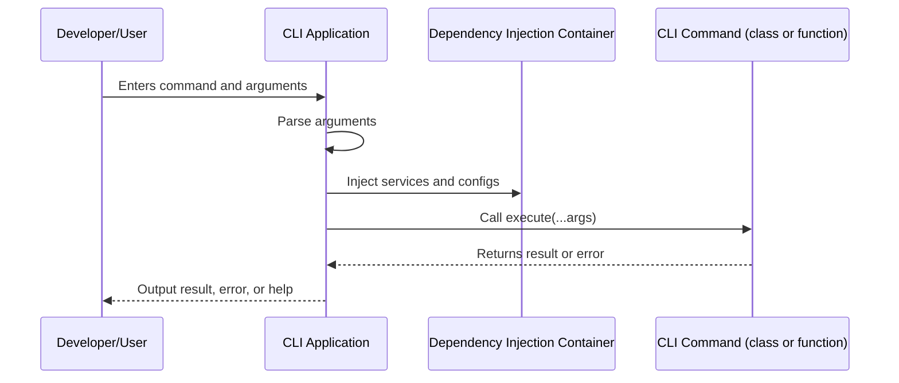

# CLI Controllers & Commands

Deepkit's CLI controllers and commands provide a streamlined, type-driven approach for building command-line applications using a class or functional style. This page covers how to define commands, declare and document CLI arguments and flags via types, handle argument parsing, perform validation, and execute commands with built-in error handling—all using Deepkit's Runtime Types system.

---

## Overview

Command-line interfaces (CLI) enable interaction with your Deepkit applications through terminal commands. Deepkit leverages TypeScript’s types and runtime reflection to automatically parse, deserialize, and validate CLI arguments and flags.

Commands can be implemented as simple async functions or as class-based controllers with an `execute` method. The framework uses decorators and runtime metadata to expose commands, document them, and handle argument binding.

All commands run within Deepkit’s Dependency Injection (DI) container, granting full access to services, configuration, event systems, and logging. This integration empowers you to build complex CLI programs with clear, maintainable code.

---

## Getting Started with CLI Controllers

### Installation and Setup

Ensure Deepkit Runtime Types are installed and properly configured. Then, install `@deepkit/app`:

```sh
npm install @deepkit/app
```

Enable TypeScript decorators by setting `experimentalDecorators` in your `tsconfig.json`:

```json
{
  "compilerOptions": {
    "experimentalDecorators": true
  },
  "reflection": true
}
```

If you use functional controllers only, decorators are optional.


### Defining Commands

Commands can be created either as functional callbacks or class controllers.

#### Functional Controller Example

```typescript
import { App, Flag } from '@deepkit/app';

const app = new App();

app.command('test', (id: number, check: boolean & Flag = false) => {
  console.log('Hello World', id, check);
});

app.run();
```

#### Class Controller Example

```typescript
#!/usr/bin/env ts-node-script
import { App, cli, Flag } from '@deepkit/app';

@cli.controller('test', {
  description: 'My first command'
})
class TestCommand {
  async execute(id: number, check: boolean & Flag = false) {
    console.log('Hello World', id, check);
  }
}

new App({
  controllers: [TestCommand]
}).run();
```

The `@cli.controller` decorator registers the command name and optionally accepts a description. The `execute` method parameters define expected CLI arguments and flags.

### Running the CLI

Invoke commands by running your script with the command name. Using the above example:

```sh
$ ./app.ts test 123 --check
Hello World 123 true
```

Or if built with `ts-node`:

```sh
$ ts-node ./app.ts test 123
Hello World 123 false
```

Commands support grouping via colon (`:`) notation, such as `user:create` or `user:remove`.

---

## Arguments & Flags

### Automatic Argument Binding

Function and method parameters are automatically converted to CLI arguments or flags based on their types and position:

- **Positional Arguments**: Regular parameters are treated as positional arguments.
- **Flags**: Parameters typed as intersection with `Flag`, e.g., `boolean & Flag`, become named flags prefixed with `--`.

### Supported Types

Deepkit supports many TypeScript types for CLI arguments:

- `string`, `number`, `boolean`, `bigint`
- Arrays and unions (e.g., multiple values for flags)
- Runtime Types and classes with serialized properties

### Default Values & Optional Parameters

Parameters with default values or marked optional are respected and produce defaults or allow omission when running.

### Example: Arguments and Flags

```typescript
app.command('user:find', async (
    name: string & Flag = '',
    age: number & Flag = 0,
    active: boolean & Flag = false,
) => {
    console.log('Filtering users by', { name, age, active });
});

// Run with flags:
// ts-node app.ts user:find --name Peter --age 20 --active
```

---

## Dependency Injection

CLI commands have full access to Deepkit’s DI container. You can inject services, configurations, or other providers directly into your commands’ constructor (for classes) or as additional parameters (for functional commands).

Example:

```typescript
class MyService {
  getData() {
    return 'Hello DI';
  }
}

app.command('hello', async (service: MyService) => {
  console.log(service.getData());
});

app.run();
```

In class controllers, define dependencies in the constructor:

```typescript
@cli.controller('test')
class TestCommand {
  constructor(private myService: MyService) {}

  async execute() {
    console.log(this.myService.getData());
  }
}
```

Register your providers appropriately in the app:

```typescript
const app = new App({
  providers: [MyService],
  controllers: [TestCommand],
});
app.run();
```

---

## Command Lifecycle & Execution

The CLI framework handles argument parsing, deserialization, type validation, and error reporting automatically.

### Command Execution Flow

1. **Parsing**: CLI arguments are parsed and mapped to command parameters.
2. **Deserialization**: Arguments are deserialized according to their runtime types.
3. **Validation**: Arguments are validated using Deepkit Runtime Types.
4. **Injection**: Dependencies are injected.
5. **Execution**: The command’s `execute()` method or functional callback is called with the deserialized arguments.
6. **Exit Code**: Commands may return an exit code integer - 0 for success, other codes indicate errors.

### Error Handling

When argument validation fails, a clear error message is presented indicating the invalid argument, expected type, and details.

If a command throws, the framework catches and outputs a failure message with stack trace.

Example of custom exit code:

```typescript
@cli.controller('test')
class TestCommand {
  async execute() {
    console.error('Something went wrong');
    return 12; // non-zero exit code
  }
}
```

---

## Documentation and Help Output

Every CLI command automatically supports help and description output.

Invoke help for commands or topics:

```sh
$ ts-node app.ts --help
$ ts-node app.ts test --help
$ ts-node app.ts user: --help
```

The CLI shows usage, available commands, their descriptions, arguments, and options with flags and defaults.

---

## Best Practices & Tips

- Use descriptive command names and group commands logically using colon (`:`) notation.
- Provide descriptions in the `@cli.controller` decorator to help users.
- Use TypeScript types and Deepkit Runtime Types to ensure argument validation and auto-documentation.
- Favor class controllers for complex commands or dependency injection scenarios.
- Leverage flags (`boolean & Flag`) for optional toggles and options.
- Return meaningful exit codes to indicate success or failures.

---

## Troubleshooting Common Issues

<AccordionGroup title="Troubleshooting">
<Accordion title="Command Not Found">
Ensure your command name matches what you invoke and that the controller or function is properly registered in your app’s controllers or commands.
</Accordion>
<Accordion title="Argument Validation Failures">
Check if the passed argument matches the expected type and constraints. Use CLI `--help` to see required arguments and flags.
</Accordion>
<Accordion title="Dependency Injection Errors">
Verify that providers are registered correctly and no circular dependencies exist. Optional dependencies can be marked as such.
</Accordion>
<Accordion title="Decorator Not Working">
Make sure TypeScript `experimentalDecorators` option is enabled and the `reflection` option is set in your `tsconfig.json`.
</Accordion>
</AccordionGroup>

---

## Example: Defining and Running a CLI Command

```typescript
#!/usr/bin/env ts-node-script
import { App, cli, Flag } from '@deepkit/app';

@cli.controller('user:create', { description: 'Create a new user' })
class CreateUserCommand {
  async execute(
    username: string,  // positional argument
    email: string & Flag,  // named flag
    active: boolean & Flag = false  // optional flag
  ) {
    console.log(`Creating user ${username} with email ${email} (active: ${active})`);
  }
}

new App({
  controllers: [CreateUserCommand],
}).run();
```

Run:

```sh
$ ./app.ts user:create alice --email alice@example.com --active
Creating user alice with email alice@example.com (active: true)
```

---

## Summary Diagram of CLI Controller Flow



---

## Additional Resources

- [Deepkit App Overview](./app.md) - Learn about the core CLI framework.
- [Getting Started with CLI](./cli/getting-started.md) - Step-by-step CLI setup guide.
- [Arguments & Flags](./app/arguments.md) - Details on argument and flag usage.
- [Dependency Injection](./app/dependency-injection.md) - Using DI with CLI.
- [Error Handling](./api-reference/api-error-handling/http-errors.md) - Handling errors in Deepkit.

---

This page provides the foundational comprehensive reference you need to create, execute, and manage CLI commands and controllers using Deepkit's powerful, type-driven approach.

---