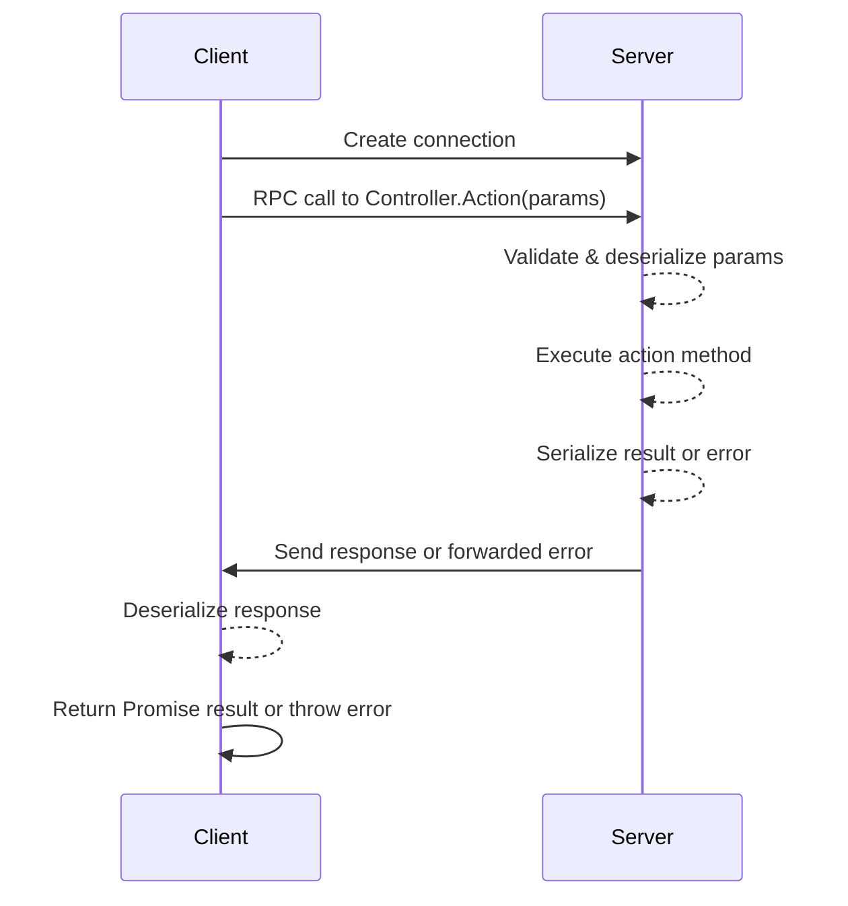

# RPC Controllers & Actions

Remote Procedure Call (RPC) in Deepkit Framework enables you to define server-side classes whose methods (called "actions") are accessible from clients as if they were local functions. This page provides a detailed reference for building and consuming RPC Controllers and Actions, focusing on how you can register controllers, define method signatures with automatic serialization and validation, and seamlessly interact between client and server while preserving strong TypeScript type-safety.

---

## What is an RPC Controller?

An RPC Controller is a TypeScript class that groups related remote actions. It is registered on the server with the `@rpc.controller(path)` decorator, where `path` is a unique identifier used by clients to call this controller. Controllers serve as the gateway for RPC communication, hosting multiple *actions* that clients invoke remotely.

Only methods explicitly decorated with `@rpc.action()` are exposed as callable RPC methods. Methods without this decorator remain private to the server.

### Example: Defining a Controller

```typescript
import { rpc } from '@deepkit/rpc';

@rpc.controller('/main')
class MyController {
  @rpc.action()
  async hello(name: string): Promise<string> {
    return `Hello ${name}`;
  }

  // This method is not exposed
  private internalMethod(): void {}
}
```

Clients use the controller path `/main` to get a proxy instance and call `hello` remotely.

---

## Defining RPC Actions (Methods)

RPC actions are class methods decorated with `@rpc.action()`. Each action’s parameters and return types must be explicitly typed — this enables Deepkit’s automatic serialization, deserialization, and validation, ensuring type safety across the network boundary.

**Key points:**
- Parameters and returns are serialized using Deepkit's fast binary protocol.
- Validation runs automatically on parameters according to their TypeScript types or additional validators.
- Both synchronous and asynchronous methods are supported.
- Streaming with RxJS Observables/Subjects is natively supported for real-time data.

### Example: Actions with Basic Types

```typescript
@rpc.controller('/user')
class UserController {
  @rpc.action()
  async getUser(id: number): Promise<User> {
    return await this.findUser(id);
  }

  @rpc.action()
  greet(name: string): string {
    return `Hello ${name}`;
  }
}
```

---

## Parameter Validation & Runtime Types

Deepkit RPC leverages the Deepkit Runtime Types system to automatically validate incoming parameters on the server side. This prevents invalid or malformed requests from being processed, enforcing data integrity.

- Use built-in validators like `Positive`, `Maximum`, or `MaxLength` by intersection types.
- Custom validators can also be defined using Deepkit type decorators.
- Validation errors result in a thrown `ValidationError` sent back to the client.

### Example: Parameter Validation

```typescript
import { Positive, Maximum, MaxLength } from '@deepkit/type';

@rpc.controller('/main')
class Controller {
  @rpc.action()
  async getUser(
    id: number & Positive & Maximum<10_000>
  ): Promise<User> {
    return new User(id);
  }

  @rpc.action()
  hello(
    name: string & MaxLength<20>
  ): string {
    return 'Hello ' + name;
  }
}
```

---

## Serialization and Nominal Type Safety

Deepkit automatically serializes and deserializes data passed in RPC calls, supporting primitive types, arrays, typed arrays, objects, and full classes including those with constructors.

To maintain nominal type identity on the client side, especially for classes, register your classes with a unique nominal ID using the `@entity.name('id')` decorator.

### Example: Register a Nominal Type

```typescript
import { entity } from '@deepkit/type';

@entity.name('user')
export class User {
  id!: number;
  username!: string;

  get displayName() {
    return `User: ${this.username}`;
  }
}
```

Without this, deserialized objects lose their prototype methods on the client.

---

## Streaming with RxJS Observables

For scenarios requiring continuous real-time data streams, Deepkit RPC supports RxJS Observables, Subjects, and BehaviorSubjects seamlessly.

- Return an Observable or Subject from a server action.
- The client receives an Observable proxy forwarding all emitted values.
- Client unsubscribe automatically triggers cleanup on the server.

### Example: Streaming Time Updates

```typescript
import { Observable, Subject } from 'rxjs';
import { rpc } from '@deepkit/rpc';

@rpc.controller('/main')
class Controller {
  protected timeSubject = new Subject<Date>();

  @rpc.action()
  timeStream(): Subject<Date> {
    // Stream current timestamps every second
    setInterval(() => {
      this.timeSubject.next(new Date());
    }, 1000);

    return this.timeSubject;
  }
}
```

### Client Usage

```typescript
const client = new DeepkitClient('localhost');
const controller = client.controller<Controller>('/main');

const subscription = (await controller.timeStream()).subscribe(time => {
  console.log('Current time:', time);
});

// Later when done
subscription.unsubscribe();
```

---

## Error Forwarding

Errors thrown in server-side actions are automatically serialized and forwarded to clients, preserving error type and message. Custom error classes can be used and are reconstructed on the client.

- Stack traces can be included or stripped for security.
- You can implement error rewriting and filtering on the server.

### Example: Custom Error Forwarding

```typescript
import { rpc } from '@deepkit/rpc';
import { entity } from '@deepkit/type';

@entity.name('@error/custom')
class CustomError extends Error {
  extraCodes: string[] = [];
}

@rpc.controller('/main')
class Controller {
  @rpc.action()
  throwError(): void {
    const error = new CustomError('Something bad happened');
    error.extraCodes = ['ERR_123', 'ERR_456'];
    throw error;
  }
}
```

### Client Side Error Handling

```typescript
try {
  await controller.throwError();
} catch (error) {
  if (error instanceof CustomError) {
    console.error('Custom error codes:', error.extraCodes);
  }
}
```

---

## Progress Tracking for Large Payloads

Deepkit RPC supports chunked transport of large upload and download payloads with built-in progress tracking mechanisms.

- Track progress from client uploads or downloads with observable subscriptions.
- Multiple transfers are handled simultaneously.

### Client Example

```typescript
const progress = ClientProgress.track();

progress.upload.subscribe(({ total, current }) => {
  console.log(`Uploading ${current} / ${total} bytes`);
});

await controller.uploadFile(new Uint8Array(10 * 1024 * 1024));

progress.download.subscribe(({ total, current }) => {
  console.log(`Downloading ${current} / ${total} bytes`);
});

const zipFile = await controller.downloadFile('archive.zip');
```

---

## Registering and Using Controllers

### Server Registration

Controllers must be registered with your RPC Kernel for the server to expose their endpoints.

```typescript
const kernel = new RpcKernel();
kernel.registerController(MyController);

// Start transport server...
```

### Client Invocation

Clients instantiate a controller proxy by referencing the controller path and the controller's interface.

```typescript
const client = new DeepkitClient('localhost');
const main = client.controller<MyController>('/main');

const greeting = await main.hello('World');
console.log(greeting); // 'Hello World'
```

---

## Best Practices & Common Pitfalls

- **Always explicitly type parameters and return types** to ensure proper serialization.
- Use **`@entity.name()` for all classes** shared between client and server to preserve class identity and methods after deserialization.
- Enable **parameter validation** to reject invalid requests early and improve security.
- Be cautious when **disabling strict serialization;** this disables type validation and may expose security risks.
- For **streaming data, use RxJS** Observables or Subjects and remember to handle subscription disposal.
- Register all **custom errors as entities** to allow forwarding with full information.
- Avoid exposing sensitive details in errors by configuring error rewriting appropriately.

---

## Troubleshooting

<AccordionGroup title="Common RPC Controller Issues">
<Accordion title="Methods Not Accessible from Client">
Ensure that the method is decorated with `@rpc.action()`. Only decorated methods are exposed over RPC.
</Accordion>
<Accordion title="Type Mismatch or Serialization Errors">
Check that all function parameters and return types are explicitly typed and compatible with Deepkit serialization. Using complex or unsupported types without registration can cause errors.
</Accordion>
<Accordion title="Class Instances Not Properly Deserialized on Client">
Verify that all classes returned by actions are decorated with `@entity.name('your.unique.id')` to maintain nominal typing.
</Accordion>
<Accordion title="ValidationError on Parameter"

If you receive ValidationError, check the parameter types and any additional validators. Use debugging to pinpoint invalid inputs.
</Accordion>
<Accordion title="Streaming Observable Does Not Complete on Client">
Make sure your server action returns a properly implemented RxJS Observable or Subject with defined teardown logic to handle unsubscriptions.
</Accordion>
</AccordionGroup>

---

## Visualization: Client-Server RPC Interaction Flow



---

## Additional Resources

- [Deepkit RPC Getting Started Guide](../rpc/getting-started.md) for setup and installation
- [Streaming with RxJS](../rpc/streaming.md) for advanced real-time data handling
- [Dependency Injection in Deepkit RPC Controllers](../rpc/dependency-injection.md) for DI integration
- [Deepkit Runtime Types & Validation](../runtime-types.md) for detailed type validation concepts
- Official Deepkit GitHub: [Deepkit Framework](https://github.com/deepkit/deepkit-framework)

---

Embrace Deepkit RPC Controllers to build seamless, real-time, and type-safe communication pathways bridging your frontend, backend, and microservices with minimal effort and maximum developer confidence.
