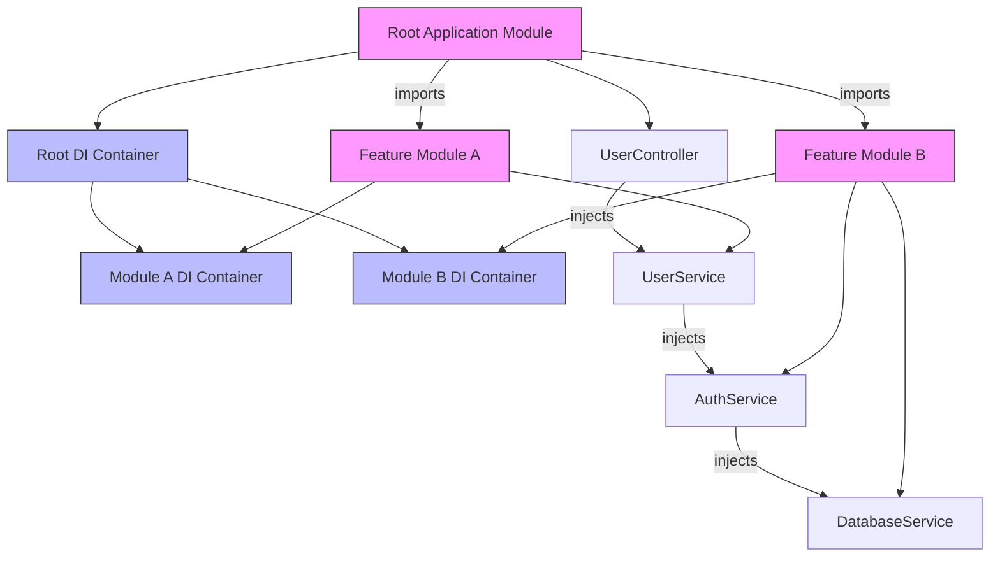

# Modularity & Dependency Injection

Deepkit Framework's design centers on modularity and dependency injection, enabling you to build scalable, maintainable, and testable applications by organizing features into independent modules, each encapsulating its providers, services, and configurations. This guide will help you understand how to leverage Deepkit’s modular architecture together with its high-performance Dependency Injection (DI) system to structure your app effectively.

---

## Why Modularity Matters

Imagine building a complex application as assembling a puzzle. Breaking your app into modules means each module represents a puzzle piece — self-contained, focused on a specific feature or domain. This allows teams to work independently, helps avoid tangled dependencies, and simplifies maintenance as your application grows.

Deepkit lets you define modules that encapsulate providers (services, classes), controllers (HTTP, RPC, CLI), and configuration settings. Modules also communicate via explicit imports and exports, establishing clear boundaries.

### Key Benefits of Using Modules

- **Isolation:** Each module has its own DI container context, limiting exposure of internal implementation.
- **Reusability:** Modules can be packaged and shared across projects.
- **Scalability:** Clear dependency graph aids growth and complexity management.
- **Configurability:** Independent configuration schema per module with validation.

---

## Understanding Dependency Injection in Deepkit

Dependency Injection (DI) is the heart of modular design in Deepkit. DI inverts control of dependencies, meaning classes receive their collaborators instead of creating them, enabling loose coupling and easier testing.


### Core DI Principles

- **Constructor Injection:** Primary and recommended way; dependencies are passed in class constructors.
- **Property Injection:** Optional or additional dependencies can be injected as properties via decorators.
- **Parameter Injection:** DI container injects dependencies directly into callback parameters (e.g., HTTP routes).

This approach lets you declare needed services without worrying about their instantiation or lifecycle.

### Dependency Injection Containers

Deepkit offers a high-performance, runtime type-based DI container (`@deepkit/injector`) that orchestrates provider creation, lifecycle, and injection automatically.

- The container automatically resolves dependency graphs.
- Supports multiple provider types (class, value, factory, existing).
- Handles scoping for request or RPC-based lifetimes.

Example of creating a container and resolving services:

```typescript
import { InjectorContext } from '@deepkit/injector';

const injector = InjectorContext.forProviders([
  UserRepository,
  HttpClient
]);

const userRepository = injector.get(UserRepository);
const users = await userRepository.getUsers();
```

---

## Deepkit Modules: Organizing Your App

### Defining a Module

Modules can be defined as class-based modules or functional modules:

```typescript
import { createModuleClass } from '@deepkit/app';

export class MyFeatureModule extends createModuleClass({
  providers: [MyService],
  controllers: [MyController],
  exports: [MyService],
  config: MyConfig
}) {}
```

```typescript
import { AppModule } from '@deepkit/app';

export function myFeatureModule(options: Partial<MyConfig> = {}) {
  return (module: AppModule) => {
    module.addProvider(MyService);
    module.addController(MyController);
    module.setConfigDefinition(MyConfig).configure(options);
  };
}
```

### Importing and Exporting Modules

- Use the `imports` array to bring other modules into your module.
- Export providers explicitly to make them available to importing modules.

```typescript
new App({
  imports: [
    new MyFeatureModule(),
  ],
}).run();
```

### Working with Configuration

Modules can define a configuration schema as a class, with optional or required properties. Deepkit validates these options automatically.

```typescript
export class MyConfig {
  host!: string;  // required
  debug: boolean = false; // default value
}
```

You configure your module by passing config options or using `.configure()`:

```typescript
new MyFeatureModule({ host: 'localhost', debug: true })
```

Use the `process` hook for dynamic adjustments based on config.

---

## Dependency Injection Providers

Deepkit supports several provider types to manage service lifecycles and substitute implementations flexibly:

| Provider Type      | Usage                                                       | Example                                                                |
|--------------------|-------------------------------------------------------------|------------------------------------------------------------------------|
| **ClassProvider**  | Maps a token to a class, default singleton scope             | `{ provide: UserService, useClass: UserService }`                     |
| **ValueProvider**  | Provides a static value or instance                          | `{ provide: Config, useValue: new Config() }`                         |
| **ExistingProvider** | Forwards one token to another existing token               | `{ provide: Logger, useExisting: ConsoleLogger }`                     |
| **FactoryProvider** | Provides a factory function that returns instance           | `{ provide: UserService, useFactory: (db: Database) => new UserService(db) }` |

### Provider Scopes

- By default, providers are **singletons** - instantiated once per application lifecycle.
- Scoped providers can be defined to create instances per request or RPC call, allowing request-specific services.

Example of a scoped provider:

```typescript
{ provide: UserSession, scope: 'http' }
```

Create scope contexts dynamically:

```typescript
const httpScope = injector.createChildScope('http');
const session = httpScope.get(UserSession);
```

---

## Practical Workflow: Building Your Modular App

### Step 1: Define Feature Modules

- Group related services, controllers, and configs per module.
- Clearly export providers needed by other modules.

### Step 2: Import Modules in Application

- In your root app or other modules, import needed modules.
- Use the `.forRoot()` method if you want a module’s providers available globally.

### Step 3: Use Dependency Injection

- Inject services into controllers or other services by declaring them in constructors.
- Take advantage of lifecycle scopes to manage transient or request-bound services.

### Step 4: Configure Modules

- Pass configuration via constructor or `.configure()` method.
- Use hooks (`process`, `postProcess`) for advanced module customization.

---

## Tips & Best Practices

- Favor constructor injection for mandatory dependencies; use property injection sparingly for optional dependencies.
- Export only providers that must be shared to keep modules encapsulated and clear.
- Use interfaces and dependency inversion for better testability and flexibility.
- Pick scopes carefully to avoid unexpected singleton sharing of stateful services.
- Leverage configuration schemas to enforce valid runtime settings.

---

## Common Pitfalls & Troubleshooting

- **Provider not found error:** Ensure providers are exported properly if used outside the module.
- **Circular dependencies:** If detected, refactor to break tight coupling, possibly using constructor injection on interfaces.
- **Scope mismatch errors:** Access scoped providers only from matching child scopes.

If issues arise, see [Troubleshooting Common Issues](../getting-started/troubleshooting-next-steps/common-issues) and [Dependency Injection Basics](../guides/core-workflows/dependency-injection-basics).

---

## Illustrative Mermaid Diagram: Module & Dependency Injection Structure



---

## Next Steps

- Dive deeper into [Modules System Guide](../guides/core-workflows/module-system-guide) to master module composition and lifecycle.
- Explore [Dependency Injection Providers](./providers.md) for advanced usage and provider types.
- Review [Scoped Providers](./scopes.md) to harness lifecycle management.
- Get hands-on with examples in [Getting Started: Dependency Injection](./getting-started.md).

---

For any advanced patterns or in-depth architecture, refer to the [System Architecture Overview](../architecture-overview/system-architecture) and [Core Concepts & Terminology](../architecture-core-concepts/core-concepts).

---

# Summary

You have learned how Deepkit Framework’s modular design empowers structuring your app into feature-based modules that encapsulate providers, controllers, and configurations. Dependency Injection orchestrates service creation and injection, supporting singleton and scoped lifetimes for clean, testable code. Practical examples and best practices guide building scalable, maintainable, and loosely coupled applications.

---

## Related Documentation

- [Dependency Injection Basics](../guides/core-workflows/dependency-injection-basics)
- [Module System Guide](../guides/core-workflows/module-system-guide)
- [Providers Reference](./providers.md)
- [DI Scopes](./scopes.md)
- [App Modules](../app/modules.md)
- [Troubleshooting Common Issues](../getting-started/troubleshooting-next-steps/common-issues)
- [System Architecture Overview](../architecture-overview/system-architecture)

---

## See Also

- [Runtime Types](../data-modeling-and-validation/runtime-types-and-reflection) - Dependency Injection requires runtime type metadata.
- [CLI, HTTP, RPC Controllers](../guides/getting-started/quickstart-cli-http-rpc) - Integrate DI into controllers.

---

Ready to architect your first modular Deepkit app? Start with creating feature modules and compose them in your root app using DI to inject and manage your dependencies effortlessly.
