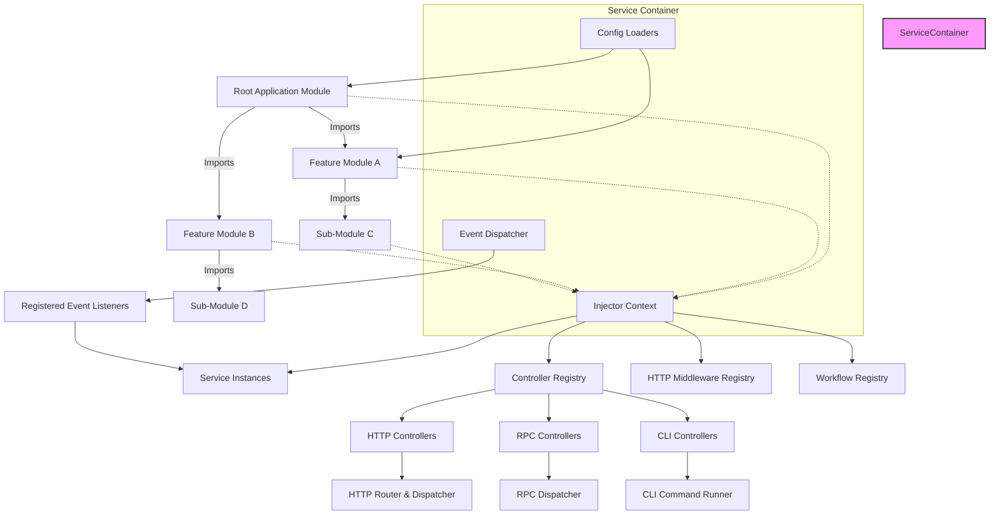

# System Architecture

Deepkit Framework is designed around a clear and modular system architecture that empowers developers to build scalable, maintainable, and real-time TypeScript applications. This page explores the major system components integral to Deepkit's architecture — focusing on the service container, the flexible module system, the controller patterns that power CLI, HTTP, and RPC interactions, and the event-driven backbone that orchestrates reactive workflows.

By understanding how these components interact through the application lifecycle—from startup to request handling, and on to event dispatch—you will gain the conceptual foundation necessary to architect robust Deepkit applications.

---

## High-Level Architecture

At the heart of Deepkit Framework lies the **Service Container**, implementing an extensible and hierarchical dependency injection (DI) system. This container loads modules, manages lifecycle hooks, and orchestrates the instantiation and provision of services, controllers, and event listeners.

**Modules** encapsulate feature sets, configuration schemas, providers (services), controllers, and commands, isolating concerns and promoting modular architecture. Modules can import other modules creating a tree structure, enabling composition and reuse.

**Controllers** handle incoming requests or commands across CLI, HTTP, and RPC protocols. They are registered within modules and processed by specialized sub-systems that extract routes, actions, or commands to wire into the application.

Underlying these is the **Event-Driven Backbone** powered by Deepkit's event system, enabling reactive programming patterns and modular event listeners to respond dynamically to system events.

This flowchart outlines key components and their relationships:

- **AppModule** and all feature modules form a hierarchical import relation, organizing app features logically.
- The **Injector Context** is the core DI container where service instances are created and managed.
- **Controllers** are registered and categorized by protocol: HTTP, RPC, CLI.
- **Event Dispatcher** delivers events to listeners, connecting across services and modules.
- **Config Loaders** dynamically load and validate configuration options per module.

---

## Key Components Overview

### 1. Service Container (Dependency Injection Core)

The service container is the backbone of dependency resolution and lifecycle management:

- **InjectorContext**: The main DI container that creates and caches instances of providers.
- **AppModule & Submodules**: Encapsulate providers, controllers, workflow definitions, event listeners, and middleware.
- **Configuration Loaders**: Inject configuration properties from environment variables, files, or programmatic sources.
- **Lifecycle Hooks**: Modules can define hooks like `process()`, `postProcess()`, and others to customize provider registration and setup before application startup.

The service container traverses the module tree during initialization, applies configuration loading and validation, processes controllers/providers/listeners, and finally builds the DI hierarchy.

### 2. Module System

Deepkit's module system is designed for encapsulation, reusability, and hierarchical composition:

- Modules are either class-based or functional.
- Each module has its own DI sub-container.
- Imports allow modules to depend on and extend others, forming a tree of functionality.
- Providers can be encapsulated or exported upward to make them available beyond their own module.
- Modules support configuration schemas, bootstrap classes, listeners, commands, and middlewares.
- Stateful modules can carry internal state, enabling shared registries such as HTTP route registries.

The module lifecycle involves several key steps starting from configuration loading, to processing imports, providers, listeners, and controllers, and culminating in service container build.

### 3. Controllers and Routing

Controllers serve as the primary integration points for different application entrypoints:

- **HTTP Controllers**: Decorated classes that expose route handlers via HTTP method decorators.
- **RPC Controllers**: Handle remote procedure calls with typed methods, enabling real-time streaming and robust RPC messaging.
- **CLI Controllers**: Define command-line commands and subcommands.

Modules register controllers, which then are processed to extract metadata and register handlers in protocol-specific routers or runners. Controllers enjoy full DI support for their dependencies.

### 4. Event-Driven Backbone

Deepkit's event system facilitates reactive and loosely coupled architectures:

- Modules register event listeners which can be classes or simple functions.
- The event dispatcher delivers events across the application, allowing services to react asynchronously.
- Event listeners can be prioritized with ordered execution.
- Used for cross-cutting concerns, internal messaging, lifecycle events, and asynchronous workflows.

---

## Application Lifecycle Flow

Understanding how these components interact during the application lifecycle is key to mastery.

<Steps>
<Step title="Initialization & Configuration Loading">
- The Root Application Module is instantiated.
- Configuration loaders apply environment variables, config files, and overrides to modules.
- Configuration schemas are validated using runtime type checking.
</Step>
<Step title="Module Processing">
- Each module's `process()` hook runs to allow dynamic adjustments.
- Recursive traversal imports all child modules.
- Providers, controllers, listeners, workflows, and middlewares are collected and registered.
</Step>
<Step title="Dependency Injection Container Build">
- A hierarchical DI container (InjectorContext) is created from the root.
- All providers are instantiated or prepared for instantiation.
- Singleton and scoped lifecycles are respected.
</Step>
<Step title="Controller & Event Listener Registration">
- Controllers are registered with protocol-specific routers or runners.
- Event listeners are registered with the event dispatcher.
- Middleware for HTTP requests is initialized.
</Step>
<Step title="Bootstrapping & Runtime">
- Bootstrap classes for modules are instantiated to allow custom startup logic.
- Runtime begins processing incoming HTTP, CLI, or RPC requests.
- Events are dispatched dynamically, with listeners reacting asynchronously.
</Step>
</Steps>

---

## Best Practices & Tips

- Always encapsulate providers in your module unless they need to be shared. Explicitly export only what others require.
- Use module `process()` hooks to conditionally add imports or providers based on configuration.
- Leverage configuration schemas to strongly type and validate module options.
- Register controllers on modules to keep routing modular and manageable.
- Place stateful registries inside your module providers to keep module state consistent and injectable.
- Use event listeners for cross-component communication, avoiding tight coupling.

---

## Troubleshooting Common Pitfalls

<AccordionGroup title="Common Issues">
<Accordion title="Module Provider Not Found">
Ensure the provider is either declared in the module or properly exported by an imported module. Missing exports make providers inaccessible outside their module.
</Accordion>
<Accordion title="Configuration Validation Failures">
Check your configuration schema declarations and ensure environment variables or config files match expected types and constraints.
</Accordion>
<Accordion title="Controller Routes Not Registered">
Verify controllers are added to the module and that the module importing the controller is included in your application or parent module.
</Accordion>
<Accordion title="Duplicate Module Instances">
Avoid reusing the same module instance across multiple imports. Each module instance must be unique to maintain proper DI container hierarchy.
</Accordion>
</AccordionGroup>

---

## Further Reading

To deepen your understanding, refer to the following documentation pages:

- [Modules](../app/modules.md) — Detailed concepts on module definitions, imports, exports, and lifecycle hooks.
- [Dependency Injection](../dependency-injection.md) — Comprehensive guide on DI principles, container usage, and injection types.
- [Controllers & Endpoints (HTTP, RPC, CLI)](../core-controllers.md) — How to define and use different controllers.
- [Event System](../event.md) — Using event dispatchers and listeners for reactive programming.
- [Configuration](./configuration.md) — Managing application and module configuration schemas.

Together, these resources equip you to effectively architect your Deepkit applications using the framework’s system architecture.

---