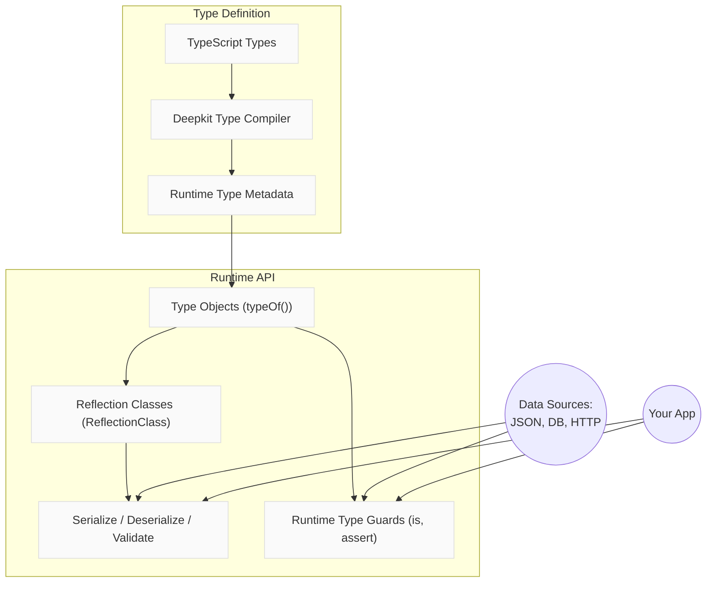

# Runtime Types & Type Reflection

Deepkit's runtime type system transforms your TypeScript types into rich data structures accessible during application runtime. This empowers you to describe, validate, serialize, and introspect complex data shapes dynamically without losing the strength of TypeScript's static type system.

This guide focuses specifically on understanding how Deepkit's runtime system harnesses decorators and advanced type metadata to make types manifest and actively usable at runtime.

---

## Why Runtime Types Matter

TypeScript compiles away all types, leaving no trace at runtime. This creates challenges for validation, serialization, data transformation, and generic programming, which all rely on concrete type information to operate safely and efficiently.

Deepkit bridges this gap by embedding detailed type metadata into your JavaScript bundles, making your TypeScript types tangible during execution. From simple aliases to object hierarchies, union types, and generics, Deepkit exposes their structures to your code for powerful runtime manipulations.

---

## Core Concepts

### 1. Type Objects

At the heart of Deepkit runtime types are *Type Objects* - simple JavaScript objects produced by the `typeOf<T>()` function representing the structure of your TypeScript types.

#### Characteristics:
- Each Type Object has a `kind` property denoting its category based on the `ReflectionKind` enum.
- Types can represent primitives (`string`, `number`), complex objects (`class`, `objectLiteral`), unions, arrays, tuples, functions, and more.
- Embedded metadata includes properties, method types, visibility, default values, and annotations.

```typescript
import { typeOf, ReflectionKind } from '@deepkit/type';

interface User {
  username: string;
  age: number;
}

const userType = typeOf<User>();
console.log(userType.kind === ReflectionKind.objectLiteral); //true
```

### 2. Reflection Classes

Reflection classes offer an OOP wrapper around Type Objects for easier interrogation and manipulation. Key classes include:
- `ReflectionClass`: Represents classes or interfaces with methods to access properties, methods, and metadata.
- `ReflectionProperty`: Provides detailed info about each property (type, optionality, annotations).
- `ReflectionMethod` and `ReflectionParameter`: Describe methods and their signatures.

Usage:

```typescript
import { ReflectionClass } from '@deepkit/type';

class User {
  username: string;
  age?: number;
}

const reflection = ReflectionClass.from(User);
const props = reflection.getProperties();
for (const prop of props) {
  console.log(prop.name, prop.type.kind, prop.isOptional());
}
```

### 3. Decorators and Annotations

Deepkit extends types with additional metadata via **type annotations** realized as decorators in TypeScript. These annotations do not just mark types but influence serialization, validation, and runtime behavior.

Examples include:
- `@PrimaryKey` marking an id property
- `@Reference` denoting foreign keys
- `@Embedded` denoting nested object flattening in serialization
- `@MapName` to customize property names during serialization

Annotations are attached to type metadata and can be queried or used by serializers and validators:

```typescript
import { ReflectionClass } from '@deepkit/type';

interface User {
  id: number & PrimaryKey;
  name: string & MapName<'user_name'>;
}

const reflection = ReflectionClass.from<User>();
const idProp = reflection.getProperty('id');
console.log(idProp.isPrimaryKey()); //true
```

### 4. Serialization & Validation

Deepkit uses the runtime type system as the authoritative source for serializing and validating data:
- The `serialize()` function turns class instances or complex objects into transportable formats (JSON, BSON).
- The `cast()` function converts plain data into structured types with correct types and nested objects.
- The type metadata drives these processes, respecting annotations, optionality, and nested types.

Example of type casting with runtime conversion:

```typescript
import { cast } from '@deepkit/type';

interface User {
  username: string;
  created: Date;
}

const data = {
  username: 'Peter',
  created: '2020-01-01T00:00:00Z'
};

const user = cast<User>(data);
console.log(user.created instanceof Date); //true
```

### 5. Type Guards and Assertions

Runtime type guards allow safe verification of any data at runtime. Functions like `is<T>(data)` and `assert<T>(data)` ensure that untrusted or external data matches expected type structures before usage.

```typescript
import { is, assert } from '@deepkit/type';

const data: any = fetchSomeJson();

if (is<User>(data)) {
  // Safe to use data as User
  console.log(data.username);
}

// Throws exception if invalid
assert<User>(data);
```

You can define validation constraints via type annotations to enhance type guards.

---

## Practical Tips and Best Practices

- Always enable the Deepkit Type Compiler during build to embed runtime type information.
- Use `cast` for loading data from external sources (e.g., HTTP bodies, databases) for automatic type conversion.
- Use `serialize` for preparing data for network transport or persistence with consistent naming and structure.
- Annotate properties with meaningful decorators (`PrimaryKey`, `Reference`, `Embedded`) to enable richer serialization and validation.
- When designing deeply nested objects, leverage `Embedded` to flatten nested data structures for easy serialization.
- Use `is` and `assert` checks when dealing with dynamic or untrusted input for maximum safety.

---

## Common Pitfalls

- Forgetting to enable the type compiler transformer will cause runtime type metadata to be missing, causing `typeOf<T>()` and related features to fail.
- Not decorating properties as optional or nullable in TypeScript can cause unexpected validation failures.
- Overusing complex unions or mapped types without proper annotations can complicate type reflection.
- Casting large datasets without proper group filtering or naming strategies can impact performance.

---

## Summary Diagram



---

## Further Reading & Related Pages

- [Deepkit Runtime Types - Getting Started](../getting-started.md)
- [Reflection API](./reflection.md)
- [Type Annotations](./types.md)
- [Serialization and Transformation](../serialization-and-transformation.md)
- [Validation and Schemas](../data-validation-and-schemas.md)

Explore these resources to deepen your mastery over working with runtime types in Deepkit.

---

## Quick Example

```typescript
import { typeOf, cast, serialize, is, assert, ReflectionClass, MapName, Embedded } from '@deepkit/type';

interface Address {
  street: string;
  city: string;
}

interface User {
  username: string & MapName<'user_name'>;
  address: Embedded<Address>;
  createdAt: Date;
}

const rawData = {
  user_name: 'alice',
  address_street: '123 Main St',
  address_city: 'Wonderland',
  createdAt: '2023-01-01T12:00:00Z'
};

// Cast raw JSON input to strongly typed User instance
const user = cast<User>(rawData);

console.log(user.address.city); // 'Wonderland'
console.log(user.createdAt instanceof Date); // true

// Serialize User back to transport format
const json = serialize<User>(user);
console.log(json.user_name); // 'alice'

// Access type metadata
const reflection = ReflectionClass.from<User>();
console.log(reflection.getProperty('address').getData());

// Runtime type guard
if (is<User>(rawData)) {
  console.log('Valid User');
} else {
  console.log('Invalid User');
}

// Throws if invalid
assert<User>(rawData);
```

---

Harnessing Deepkit's runtime type system equips your application with real-time visibility into type shapes, enabling flexible validation, serialization, and reflection grounded in your actual TypeScript types.

---

# End of guide
