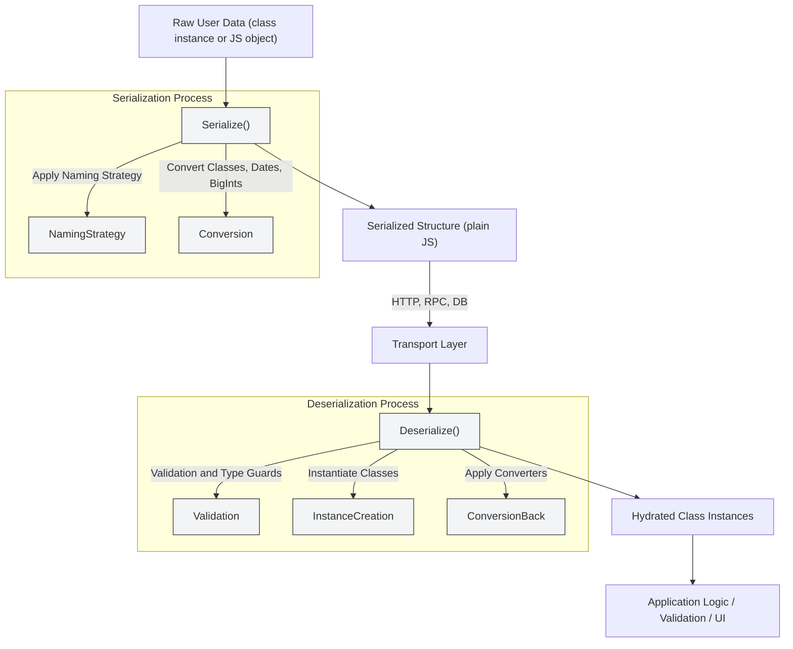

# Serialization & Transformation

Deepkit Framework provides a robust system for serializing and deserializing data, enabling seamless and typesafe data exchange across HTTP, RPC, and persistence boundaries. This guide explores how Deepkit handles data serialization, deserialization, and transformation, highlighting customization options for advanced scenarios, integration with external systems, and enforcing strict data contracts.

---

## Introduction to Serialization in Deepkit

Serialization converts complex JavaScript and TypeScript data structures into portable formats that can be transmitted or stored, such as JSON or binary payloads. Conversely, deserialization reconstructs these objects from the transported format, restoring type safety and class instances.

Deepkit’s serialization engine goes beyond native `JSON.stringify` and `JSON.parse` limitations by preserving type information (e.g., dates, bigints, class instances). This ensures lossless and type-safe data transformation across network boundaries or storage layers.

### Why Deepkit Serialization Matters

- **Lossless transformation**: Maintains fidelity of types like `Date`, `BigInt`, `Uint8Array`, Maps, Sets, and user-defined classes.
- **Strict or loose mode**: Choose between rigorous type enforcement or more flexible type coercion.
- **Declarative approach**: Works with TypeScript types and runtime reflections.
- **Customizable**: Enable advanced behaviors or adapt to external system formats.


## How Deepkit Serializes & Deserializes Data

The serialization and deserialization process in Deepkit uses the [@deepkit/type](https://github.com/deepkit/deepkit-framework/tree/main/packages/type) library, which provides a powerful runtime type system and template-based code generation for efficient serialization operations.

### Key Functions

- `serialize<T>(data: T)`: Converts an instance of a type `T` into a plain JavaScript structure that can be safely stringified (e.g., JSON).
- `deserialize<T>(data: any)`: Converts raw input data into an instance of type `T`, applying necessary transformations and type conversions.
- `cast<T>(data: any)`: Similar to deserialize but enforces validation strictly, throwing if the data type does not match.
- `validatedDeserialize`: Deserializes data and applies full validation, throwing detailed errors on failure.

These functions ensure that transforming data back and forth between transports or storage and runtime objects maintains both structure and semantic correctness.

### Supported Data Types

Deepkit can serialize and deserialize:

- Primitive types (`string`, `number`, `boolean`, `bigint`)
- `Date` objects (converted to ISO strings and restored correctly)
- Arrays, Tuples
- Classes with constructor invocation and nested properties
- Maps and Sets (transformed to array representations internally)
- Enums
- Typed Arrays and ArrayBuffers (encoded as base64 strings)
- Union and Intersection types
- Custom user types via decorators and extension points

---

## Strict vs. Loose Serialization Modes

By default, Deepkit enforces **strict serialization**:

- Types in function parameters and returns are *strictly* checked.
- Data that does not conform will cause errors.
- Prevents silent data corruption and security vulnerabilities.

**Loose mode** relaxes some checks and allows broad conversions, useful during development or with untrusted input that requires flexible handling.

> ⚠️ Disabling strict serialization is risky in production unless you thoroughly sanitize inputs and outputs to avoid injection or runtime errors.

---

## Customization of Serialization

Deepkit's serialization system is highly extensible, allowing you to tailor the process to fit custom scenarios:

### Naming Strategies

Control how property names are serialized and deserialized—important when interfacing with systems using different naming conventions.

Example:

```typescript
import { underscoreNamingStrategy } from '@deepkit/type';

// Use underscore scheme for JSON keys
const serializer = new Serializer();
serializer.namingStrategy = underscoreNamingStrategy;
```

### Custom Transformations (Conversion Hooks)

For properties needing special handling (e.g., encrypting fields, custom formats), hooks let you register converters that transform values during serialization or deserialization.

Example:

```typescript
serializer.deserializeRegistry.registerClass(Date, (type, state) => {
    state.convert((v: any) => new Date(v));
});
serializer.serializeRegistry.registerClass(Date, (type, state) => {
    state.convert((v: Date) => v.toISOString());
});
```

### Using Decorators and Annotations

Deepkit supports runtime decorators to influence serialization:

- `@embedded` for nested objects
- `@excluded` to omit properties from serialization
- Validators and type guards to enforce constraints

These are automatically recognized during serialization flows.

---

## Serialization Workflow and User Flow

1. **Data Preparation**: You start with your native class or structured data.
2. **Serialize Call**: Pass it to `serialize<T>(data)` for conversion.
3. **Transport or Store**: Serialized data is safe to send over HTTP, RPC, or save to databases.
4. **Deserialize Call**: Received or retrieved data is passed to `deserialize<T>(input)` to reconstruct full, typesafe instances.
5. **Use Result**: The deserialized object supports all class methods and validations.


## Serialization in RPC Actions

Deepkit RPC automatically applies the serialization system to method arguments and return values, ensuring:

- Parameter data sent over the network is validated and deserialized into expected types.
- Return values are serialized before transmission.
- Validation errors on wrong types are forwarded clearly.
- Supports complex types including observables, binary data, and nested classes.

Example:

```typescript
import { rpc } from '@deepkit/rpc';

@rpc.controller('/users')
class UserController {
  @rpc.action()
  async getUser(id: number): Promise<User> {
    // Returns a fully hydrated User instance
    return await userService.findById(id);
  }
}
```

The RPC framework handles serialization seamlessly behind the scenes.

---

## Best Practices & Tips

- **Always enable strict serialization in production** to ensure data integrity and security.
- Use **validation annotations** for extra data contract enforcement.
- Leverage **custom converters** for special data formats or external system compatibility.
- Avoid overcomplicating serialization; keep data models clean and use decorators for customization.

---

## Common Troubleshooting Scenarios

<AccordionGroup title="Serialization Troubleshooting">
<Accordion title="Unexpected Data Types After Deserialization">
Ensure that the correct runtime types are registered with Deepkit type reflection, and the serialization is using the proper registry. Missing reflection metadata can cause fallback to plain objects.
</Accordion><Accordion title="Errors When Passing Invalid Data to RPC Methods">
Check that strict serialization is active. Validation errors thrown by Deepkit indicate type mismatches. Review your type annotations and input data.
</Accordion><Accordion title="Loss of Date or Binary Data Fidelity in JSON Transport">
Make sure you use Deepkit's serialization instead of native JSON methods. The framework converts Dates to ISO strings and restores them as Date objects automatically.
</Accordion><Accordion title="Custom Serialization Not Triggered for Classes">
Confirm that custom serializers or converters are registered before runtime, and class decorators are properly applied. Also, check naming strategy conflicts.
</Accordion></AccordionGroup>

---

## Diagram: Data Serialization Flow in Deepkit



---

## Additional Resources

- [Deepkit Runtime Types & Reflection](https://docs.deepkit.com/concepts/data-modeling-and-validation/runtime-types-and-reflection)
- [RPC Controllers & Actions](https://docs.deepkit.com/api-reference/core-controllers/rpc-controllers)
- [Data Validation & Schemas](https://docs.deepkit.com/concepts/data-modeling-and-validation/data-validation-and-schemas)
- [Custom Serializer Development](https://github.com/deepkit/deepkit-framework/tree/main/packages/type)

---

## Summary

In this page, you learned how Deepkit Framework’s serialization system acts as a critical backbone that converts data transparently and safely between runtime objects and transport-ready formats. By leveraging the powerful `@deepkit/type` package and runtime type reflection, Deepkit supports advanced serialization needs across various protocols like HTTP and RPC while guarding type integrity.

---

For deeper hands-on experience, see the [Serialization Guide](https://docs.deepkit.com/concepts/data-modeling-and-validation/serialization-and-transformation) and explore example usage in [Deepkit RPC](https://docs.deepkit.com/library/rpc) where serialization plays a pivotal role.
