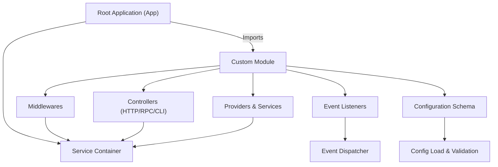

# Extending & Customizing Deepkit

Tailoring Deepkit Framework to your organization's unique needs unlocks its full potential. This guide walks you through extending Deepkit by writing custom modules, middlewares, providers, and event listeners. You will learn how to architect your extensions for maintainability, clean integration, and smooth upgrade paths.

---

## Why Customize Deepkit?
Deepkit is designed to be flexible and modular. While it works perfectly out-of-the-box, every organization faces unique domain rules, integrations, or architectures that require tweaking or extending the framework. Customization empowers you to:

- Add reusable features isolated in modules
- Intercept and modify request or event flows via middlewares
- Provide your own specialized services
- React to runtime events with event listeners

This keeps your business logic encapsulated, testable, and upgrade-safe.

---

## Custom Modules: The Heart of Extension
Modules are the fundamental building blocks in Deepkit to extend functionality. They provide scoped dependency injection, configuration, commands, controllers, middlewares, and event listeners.

### Defining a Custom Module
You can create modules by extending `AppModule` or using `createModuleClass`:

```typescript
import { createModuleClass } from '@deepkit/app';

export class MyCustomModule extends createModuleClass({
  providers: [MyService],
  controllers: [MyController],
  exports: [MyService],
  listeners: [MyListener],
  middlewares: [myMiddlewareFactory],
  name: 'myCustomModule',
  // optionally set root to true to place providers in root container
  // root: true,
}) {
   process() {
     // Modify imported modules or configuration dynamically here
   }
}
```

If you prefer a functional style:

```typescript
import { AppModule } from '@deepkit/app';

export function myCustomModule() {
  return (module: AppModule) => {
    module.addProvider(MyService);
    module.addController(MyController);
    module.addListener(MyListener);
    module.addMiddleware(myMiddlewareFactory);
    module.name = 'myCustomModule';
  };
}
```

### Key Module Extension Points

- `providers`: Services that your module offers.
- `controllers`: RPC/HTTP/CLI controllers exposed by your module.
- `listeners`: Event listeners for reacting to framework and app events.
- `middlewares`: Middleware factories to intercept and modify request flows.
- `exports`: Providers you want to make available to importers.
- `imports`: Other modules to include.
- `process()`: Hook for dynamic configuration and module manipulation.
- `postProcess()`: Final setup after all modules are processed.

### Module Configuration
Define a configuration class with typed properties and register it with your module. This supports type-safe injection and environment-based overrides.

```typescript
export class MyConfig {
  featureFlag: boolean = false;
  apiEndpoint?: string;
}

export class MyCustomModule extends createModuleClass({
  config: MyConfig
}) {}
```

You can then provide config values via constructor, `.configure()`, environment variables, or loaders.

### Using Your Module
Import your module into your app or other modules to use it:

```typescript
new App({
  imports: [new MyCustomModule({ featureFlag: true })]
}).run();
```

Or dynamically configure during setup:

```typescript
new App({
  imports: [new MyCustomModule()]
}).setup((module, config) => {
  module.getImportedModuleByClass(MyCustomModule).configure({ featureFlag: true });
}).run();
```

---

## Creating Custom Providers
Providers are the services and classes injected into your app modules. Writing custom providers allows you to encapsulate business logic, database access, or integration layers.

### Basic Provider Example

```typescript
import { injectable } from '@deepkit/injector';

@injectable()
class MyService {
  getValue(): string {
    return 'Hello from MyService';
  }
}
```

Add your provider to a module using `providers` or `addProvider()`:

```typescript
export class MyModule extends createModuleClass({
  providers: [MyService]
}) {}
```

### Scoped Providers and Lifecycle
Deepkit supports various provider lifecycles such as singleton (default), transient, and request-scoped. Use provider options to adjust behavior if needed.

---

## Building Middlewares to Control Request Flow
Middlewares let you intercept requests and responses, enabling you to add logging, authentication, metrics, or modify data on the fly.

### Creating a Middleware Factory
A middleware factory is a function returning a middleware configuration:

```typescript
import { MiddlewareFactory } from '@deepkit/app';

const myMiddlewareFactory: MiddlewareFactory = () => {
  return {
    getClassTypes() {
      // return classes needed by this middleware or []
      return [];
    }
  };
};
```

### Registering Middlewares
Attach middlewares to your module:

```typescript
export class MyModule extends createModuleClass({
  middlewares: [myMiddlewareFactory]
}) {}
```

Middlewares integrate deeply with HTTP and RPC stacks, allowing you to:

- Validate or mutate requests
- Enforce authentication or authorization
- Log requests and responses
- Measure performance

---

## Responding to Runtime Events with Event Listeners
Deepkit’s event system lets you hook into framework and application lifecycle events.

### Defining Event Listeners
Listeners can be classes or functions annotated to listen to specific events:

```typescript
import { onEvent, eventDispatcher, EventListener } from '@deepkit/event';

class MyListener {
  @eventDispatcher.listen(onEvent)
  onEventHandler(event: typeof onEvent['type']) {
    console.log('Event occurred:', event);
  }
}
```

### Registering Listeners
Add listeners in module definition:

```typescript
export class MyModule extends createModuleClass({
  listeners: [MyListener]
}) {}
```

Listeners receive events asynchronously, enabling you to customize app behavior reactively.

---

## Working with Module Lifecycle Hooks
Deepkit modules offer lifecycle hooks where you can plug in custom logic at specific stages.

| Hook Method       | When it Runs                                           | Use Case                                                 |
|-------------------|-------------------------------------------------------|----------------------------------------------------------|
| `setupConfig`     | Before config validation                               | Adjust config dynamically                                 |
| `process`         | After validation, before service container build      | Add imports, providers, or modify config dynamically     |
| `processController` | For each registered controller                         | Inspect or register routes                                |
| `processProvider` | For each registered provider                           | Auto-register services, customize providers              |
| `postProcess`     | After all modules processed, before DI container build | Final setup tasks or provider configuration               |

Example use:

```typescript
export class MyModule extends createModuleClass({}) {
  process() {
    if (this.config.featureFlag) {
      this.addImport(new OtherModule());
    }
  }

  postProcess() {
    this.configureProvider(MyService, provider => {
      provider.setup();
    });
  }
}
```

---

## Best Practices for Customization

- **Encapsulate functionality** in separate modules with clear configuration.
- **Avoid global side effects**, prefer exports and imports over root injection.
- **Use lifecycle hooks** to manage dynamic behaviors and dependencies.
- **Name your modules** to enable environment variable config overrides.
- **Export only necessary providers** to prevent dependency contamination.
- **Keep middlewares focused** and reusable.
- **Test custom providers and event listeners** independently.
- **Document your modules** clearly to simplify team collaboration.

---

## Troubleshooting & Tips

- **Module not picking up providers?** Ensure providers are added in `providers` or via `addProvider`.
- **Configuration changes ignored?** Validate that config is correctly loaded and hook into `setupConfig` or `process` to make runtime changes.
- **Circular dependencies?** Review imports to avoid modules requiring each other.
- **Event listeners not triggered?** Confirm listener registration in module and proper event token usage.
- **Middleware not applied?** Verify middleware is registered and the relevant stack supports it.

---

## How This Fits in the Deepkit Ecosystem
This page focuses exclusively on customizing Deepkit via modules, providers, middlewares, and event listeners. For a broader view on:

- [Modular architecture and DI principles](../architecture-overview/modularity-and-dependency-injection)
- [Using controllers for HTTP, RPC, and CLI](../../api-reference/core-controllers)
- [Building and consuming RPC APIs](../../guides/real-time-apis-and-integrations/building-rpc-apis)
- [Configuration management](../configuration-basics)
- [Event-driven systems and workflows](../architecture-overview/event-driven-and-reactive-systems)

please consult respective guides.

---

## Visualizing the Module Extension Flow


This diagram illustrates an app importing a custom module which brings providers, controllers, middlewares, listeners, and configuration. After loading and validation, they integrate into the service container and event system, powering runtime behavior.

---

## Summary
Customizing Deepkit via modules, providers, middlewares, and event listeners helps you build a scalable and maintainable architecture adapted to your precise business needs. Leverage module lifecycle hooks and configuration schemas for dynamic, powerful extensions. By encapsulating your innovations within modules, you future-proof your application for upgrades and collaboration.

---

For examples and advanced scenarios, explore the [Modules Guide](../app/modules.md) and the [Dependency Injection Basics](../../guides/core-workflows/dependency-injection-basics.md).