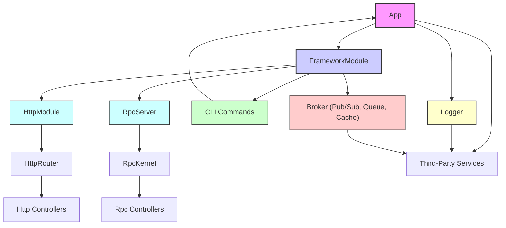

# Integration Patterns

Deepkit Framework offers powerful integration capabilities that enable you to connect your application seamlessly with other services. This page provides practical guidance on exposing HTTP APIs, building real-time RPC endpoints, wiring up Command-Line Interfaces (CLI), and leveraging third-party integrations like logging and monitoring. Whether you want your application to serve HTTP requests, communicate via RPC, or execute custom CLI commands, this guide will help you realize those integration goals efficiently.

---

## Exposing HTTP APIs

HTTP APIs are the backbone for many web applications and services. Deepkit Framework allows you to expose HTTP endpoints quickly by defining HTTP controllers and routes.

### How it Works

You create controllers decorated with HTTP method annotations such as `@http.GET`, `@http.POST`, etc. These controllers get registered into the framework's HTTP Router and mapped to URL paths.

You can:

- Process URL parameters, queries, headers, and request bodies with automatic type-safe validation.
- Respond with serialized objects, strings, or streams.
- Utilize middleware for cross-cutting concerns like authentication or logging.

### Example: Creating a Simple HTTP Controller

```typescript
import { http } from '@deepkit/http';

@http.controller('/api')
class ApiController {
    @http.GET('/hello')
    hello() {
        return { message: 'Hello from Deepkit HTTP!' };
    }
}

const app = new App({
    controllers: [ApiController],
    imports: [new FrameworkModule()]
});

app.command('server:start', async () => {
    // starts HTTP server automatically
});

app.run();
```

### Tips & Best Practices

- Use Deepkit's runtime type system for request validation to ensure client requests are correctly structured.
- Leverage the HTTP Router Registry to dynamically add or inspect routes if necessary.
- Enable HTTP logging in `FrameworkModule` configuration (`httpLog: true`) for easier troubleshooting.

---

## Building Real-Time RPC Endpoints

Real-time Remote Procedure Call (RPC) endpoints support bidirectional communication with strongly typed methods, ideal for microservices or full-duplex client-server interactions.

### Core Concepts

- **RPC Controllers:** Classes annotated with `@rpc.controller()` expose methods as remotely callable actions via `@rpc.action()` decorators.
- **Streaming Support:** Use RxJS Observables to push streaming data in real-time.
- **Safe Serialization:** Deepkit handles serialization and validation of all RPC data, preserving class types and complex structures.

### Example: Defining an RPC Controller

```typescript
import { rpc } from '@deepkit/rpc';

@rpc.controller()
class ChatController {
    @rpc.action()
    sendMessage(message: string) {
        // handle incoming message
        return `Received: ${message}`;
    }
}

const app = new App({
    controllers: [ChatController],
    imports: [new FrameworkModule()]
});

app.command('server:start').run();
```

### Leveraging HTTP for RPC Calls

The framework provides an HTTP RPC adapter that lets you call RPC methods over HTTP endpoints transparently.

- Enable via `httpRpcBasePath` configuration in `FrameworkModule`.
- Supports GET and POST requests to `/rpc/:controller/:method`.

### Real-World Scenario

Implement chat apps, game servers, or microservices communication using Deepkit RPC for real-time bi-directional interactions, with automatic error forwarding and type safety.

---

## Wiring Up CLI Commands

Deepkit provides a first-class CLI framework allowing you to create commands executed in terminal environments.

### How Commands Work

- Commands can be defined as class controllers with `@cli.controller` or using functional styles with app.command().
- Arguments and flags are deduced from method signatures using runtime types.
- Dependency Injection is available inside commands for services like logger or database.

### Example: Defining a CLI Command

```typescript
import { cli } from '@deepkit/app';

@cli.controller('greet')
class GreetCommand {
    async execute(name: string = 'World') {
        console.log(`Hello, ${name}!`);
    }
}

new App({
    controllers: [GreetCommand],
    imports: [new FrameworkModule()]
}).run();
```

### Executing

Run your CLI command via:

```bash
npx ts-node app.ts greet --name Deepkit
```

### Best Practices

- Use flags and argument typing for better UX and validation.
- Leverage dependency injection to reuse services in commands.
- Group commands logically via CLI namespaces.

---

## Leveraging Third-Party Integrations

Deepkit Framework's modular design facilitates easy integration with third-party services such as logging, monitoring, and message brokers.

### Logging

- Use Deepkit Logger providers integrated throughout your app.
- Configure transports (console, file, remote services) as needed.

### Monitoring

- Enable profiling with the `profile` and `debug` options in `FrameworkModule` configuration.
- Access a built-in debugger with HTTP endpoints for insights.

### Message Queues and Brokers

- Use integrated Broker components to connect with distributed systems.
- Broker support includes caching, locking, queuing, and pub/sub mechanisms.

### Example: Adding a Logger

```typescript
import { Logger } from '@deepkit/logger';

class MyService {
    constructor(protected logger: Logger) {}

    doTask() {
        this.logger.log('Task started');
        // ...
        this.logger.log('Task completed');
    }
}
```

### Tips

- Configure logging levels and transports per environment.
- Use event listeners to hook into lifecycle events and send metrics.
- Build modular providers encapsulating third-party integration logic for reusability.

---

## Integration Flow Overview

This diagram illustrates how the main integration components in Deepkit Framework interact:



---

## Troubleshooting Common Issues

| Issue                                   | Cause/Possible Fix                                                |
|----------------------------------------|------------------------------------------------------------------|
| HTTP routes not found                   | Make sure controllers are registered and imported correctly.     |
| RPC method calls fail                   | Ensure RPC controllers have unique path names and are registered.|
| CLI commands not appearing              | Verify commands are added to controllers or via `app.command()`. |
| Logging output missing                  | Confirm Logger providers and transports are configured properly. |
| Broker connectivity issues              | Check broker config and network connectivity.                    |

## Summary

This page detailed how to integrate Deepkit Framework with external and internal services by:

- Exposing HTTP APIs with type-safe routing and validation.
- Building powerful real-time RPC endpoints with streaming and error forwarding.
- Wiring up CLI commands with automatic argument parsing and DI.
- Leveraging third-party services for logging, monitoring, and messaging.

By harnessing these patterns, you can construct scalable, maintainable, and well-integrated Deepkit applications that meet modern enterprise requirements.


---

For additional examples and conceptual deep dives, you may want to consult:

- [HTTP Controllers & Endpoints](/api-reference/core-controllers/http-controllers)
- [Building Real-Time RPC APIs](/guides/real-time-apis-and-integrations/building-rpc-apis)
- [CLI Controllers & Commands](/api-reference/core-controllers/cli-controllers)
- [Deepkit Libraries & Ecosystem](/overview/integration-and-ecosystem/ecosystem-libraries)
- [Event-Driven & Reactive Systems](/concepts/architecture-overview/event-driven-and-reactive-systems)

Continue your mastery journey by exploring these for concrete usage, code samples, and advanced patterns.
