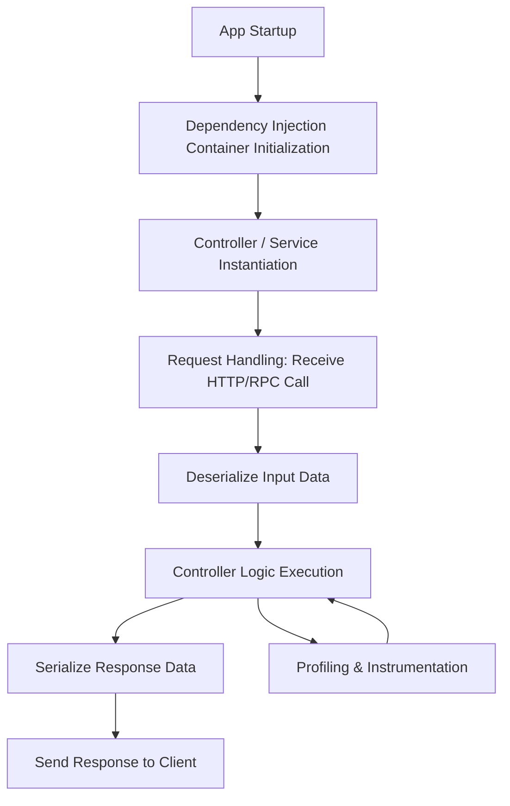

# Performance Characteristics

Deepkit Framework is built with a foundational commitment to **high-performance application development**. This page unpacks the core principles and strategies that ensure your Deepkit applications run efficiently, scale well, and remain responsive even under demanding workloads. Users will gain insight into how Deepkit achieves minimal runtime overhead, seamless dependency injection, rapid serialization, and built-in instrumentation for profiling and monitoring.

---

## 1. Minimal Runtime Overhead

Deepkit’s architecture prioritizes runtime efficiency at every layer, minimizing unnecessary computational costs and latency during execution.

- **Zero-cost abstractions:** The framework leverages TypeScript’s type system and compile-time operations to reduce runtime type-checking overhead wherever possible.
- **Lean core libraries:** Only essential features are loaded and executed, avoiding bulky dependencies or excessive indirection.
- **Compiled metadata:** Reflection metadata and decorators are processed at build time to reduce runtime reflection costs.

### User Impact
For developers, this translates into applications that respond quickly even as complexity grows, ensuring smooth user experiences without performance lag.

<Check>
Optimal runtime overhead means your app spends more CPU cycles on business logic, less on framework bookkeeping.
</Check>

---

## 2. Efficient Dependency Injection (DI)

Dependency Injection in Deepkit is designed not only for modularity and testability but also for speed and memory efficiency.

- **Static Provider Resolution:** Providers and their dependencies are resolved with minimal runtime indirection, avoiding costly lookup operations.
- **Scoped Lifecycles:** DI container supports various lifecycles (singleton, transient, request-scoped) with efficient instance management to prevent leaks or excess overhead.
- **Constructor Injection:** This common pattern keeps graph resolution simple and fast, with predictable instantiation patterns.

### How to Use
When defining services and controllers:

```typescript
@Injectable()
class UserService { /* ... */ }

class UserController {
  constructor(private readonly userService: UserService) {}

  // This injection runs efficiently under the hood
}
```

### Best Practices
- Register only required providers within modules to keep container size minimal.
- Use scopes wisely to balance between reuse and isolation.

---

## 3. Fast Serialization & Deserialization

Serialization is critical when exchanging data between layers (HTTP, RPC, database). Deepkit’s serialization system is optimized for speed and type fidelity.

- **Type-driven Serialization:** Leveraging runtime types, Deepkit serializes only validated, well-defined data structures, reducing unnecessary overhead.
- **Strict and Loose Modes:** Choose between strict structural validation for safety or loose mode for flexibility without compromising speed.
- **Customizable Converters:** Extend or override serialization strategies for complex user types while maintaining performance.

### Real-World Scenario
Sending data via RPC or HTTP:

```typescript
const user = new User({ id: 1, name: 'Alice' });
const json = serialize(user); // Fast, safe transform to JSON
const restored = deserialize(User, json); // Quick reconstruction
```

### Troubleshooting Serialization
- If performance issues appear, validate that data models are minimal and leverage the strict runtime types to avoid costly dynamic computations.

---

## 4. Built-in Instrumentation for Profiling & Monitoring

Deepkit includes tooling for developers to profile and monitor application performance seamlessly.

- **Stopwatch Integration:** Measure execution time of blocks, functions, or services.
- **Event Hooks:** Tap into lifecycle events to track performance metrics or add custom telemetry.
- **Benchmarking Utilities:** Run repeatable benchmarks for critical code paths (e.g., service methods) to detect regressions early.

### How It Works
Example benchmarking utility usage:

```typescript
import { bench } from '@deepkit/stopwatch';

bench(100, 'UserService.fetch', i => {
  userService.fetchUser(i);
});
```

This logs average execution time, highlighting potential bottlenecks.

<AccordionGroup title="Profiling Tips and Best Practices">
<Accordion title="Instrument Critical Paths">
Focus instrumentation on core logic paths impacting user experience to get actionable insights.
</Accordion>
<Accordion title="Use Automated Benchmarks">
Integrate benchmarks into CI pipelines to catch performance degradations during development.
</Accordion>
<Accordion title="Monitor in Production">
Leverage Deepkit’s event-based monitoring to track live app performance and detect anomalies.
</Accordion>
</AccordionGroup>

---

## Understanding the Performance Workflow

### User Journey
When you build and run a Deepkit app, this sequence ensures optimal speed:

1. **Application Startup:** Dependency Injection graph is constructed efficiently, with provider instances created on-demand.
2. **Request Handling:** Incoming HTTP or RPC calls are dispatched rapidly to controllers, utilizing fast serialization for incoming parameters.
3. **Business Logic Execution:** Access injected services without expensive lookups or reflection.
4. **Response Serialization:** Data returned to clients is serialized within milliseconds.
5. **Profiling:** Instrumentation captures granular timing data transparently.

### Visualizing Data Flow



---

## Common Pitfalls and How to Avoid Them

- **Overloaded DI Graph:** Avoid registering unnecessary providers globally; keep modules focused.
- **Heavy Data Models:** Large or deeply nested models can slow serialization; minimize data structures.
- **Too Many Scoped Instances:** Excessive transient or request-scoped services can increase memory and GC pressure.
- **Skipping Profiling:** Without instrumentation, identifying bottlenecks becomes guesswork.

---

## Summary
Deepkit Framework's performance characteristics are engineered for speed and scalability through deliberate design choices focusing on minimal runtime overhead, efficient dependency injection, rapid and safe serialization, plus integrated tools for profiling and monitoring. By following best practices and leveraging provided utilities, developers deliver high-performance applications that handle complex operations smoothly and remain maintainable.

---

## Next Steps
- Explore the [Dependency Injection Basics](guides/core-workflows/dependency-injection-basics) for practical DI techniques.
- Dive into [Serialization & Transformation](concepts/data-modeling-and-validation/serialization-and-transformation) to master data handling.
- Use [Performance Optimization Strategies](guides/advanced-and-optimization/performance-optimization) for deeper tuning.
- Monitor your applications using [Monitoring and Logging](deployment/operational-excellence/monitoring-and-logging) best practices.


---

## Additional Resources
- [System Architecture Overview](overview/architecture-core-concepts/architecture-diagram)
- [Core Concepts & Terminology](overview/architecture-core-concepts/core-concepts)
- [Runtime Types & Reflection](concepts/data-modeling-and-validation/runtime-types-and-reflection)
- [Dependency Injection and Modules](concepts/architecture-overview/modularity-and-dependency-injection)


<Tip>
Performance is not just about raw throughput but maintaining consistent, predictable responsiveness. Build with Deepkit to achieve both.
</Tip>
