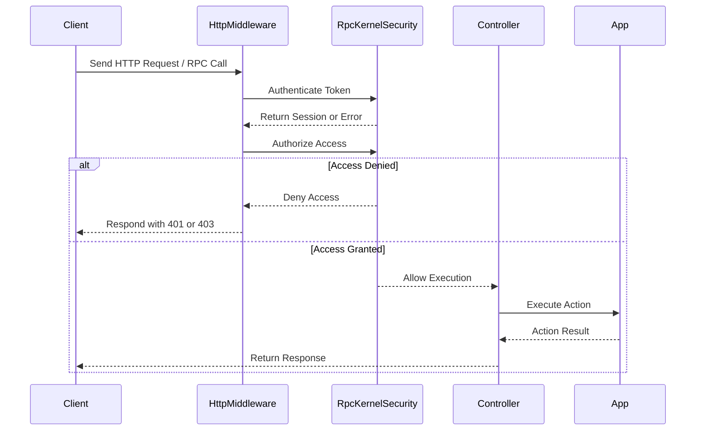

# Security Model & Permissions

Deepkit applications are built with a comprehensive security model designed to seamlessly integrate authentication, authorization, and permissions into your modules, controllers, and RPC endpoints. This guide walks you through fundamental concepts, practical implementation techniques, and best practices to protect your application's sensitive data and business logic.

---

## Understanding the Security Fundamentals

At the heart of Deepkit's security is a unified system where authentication and authorization are embedded into the architecture of your application. This approach allows for fine-grained control over access to HTTP routes, RPC methods, and modular services.

### What You Will Learn

- How Deepkit defines and enforces permissions within modules and controllers
- Integrating authentication workflows
- Implementing authorization guards for route and RPC method protection
- Customizing error handling related to security violations
- Best practices to safeguard your business logic effectively

---

## Security Components Overview

Deepkit security involves several key components working together:

| Component                  | Responsibility                                            |
|----------------------------|-----------------------------------------------------------|
| **Session**                | Represents the authenticated user state                   |
| **Authentication**         | Verifies user identity, often by tokens or credentials    |
| **Authorization**          | Determines if a session/user can access specific controllers or actions |
| **Middleware**             | Intercepts requests for access control enforcement        |
| **Error Handling**         | Processes and customizes responses for unauthorized access or authentication failures |
| **Dependency Injection**   | Injects security-related services like session managers or authenticators into controllers |

---

## Authentication in Deepkit

Authentication is the mechanism where users identify themselves to the system. Deepkit accommodates various authentication methods, typically token-based.

### How Deepkit Handles Authentication

- The `RpcKernelSecurity` class provides a default security implementation
- When a client connects, it can provide a token that is passed to the `authenticate` method
- The authentication result is a `Session` object, describing the user's identity and claims

#### Example: Custom Authentication Implementation

```typescript
import { RpcKernelSecurity, Session, RpcControllerAccess } from '@deepkit/rpc';

// Define a user session class
class UserSession extends Session {
    // You can add extra user context here
}

// Extend default KernelSecurity to customize authentication
class MyKernelSecurity extends RpcKernelSecurity {
    async authenticate(token: any): Promise<Session> {
        // Implement your token verification logic
        if (token === 'secure-token-abc123') {
            return new UserSession('authenticatedUser', token);
        }
        throw new Error('Authentication failed');
    }

    // Basic access control logic
    async hasControllerAccess(session: Session, controllerAccess: RpcControllerAccess): Promise<boolean> {
        // Example: only allow authenticated users
        return session instanceof UserSession;
    }
}
```

### Integration

Register your custom security provider in your app:

```typescript
import { App } from '@deepkit/app';
import { RpcKernelSecurity } from '@deepkit/rpc';
import { FrameworkModule } from '@deepkit/framework';

new App({
    controllers: [MyRpcController],
    providers: [{ provide: RpcKernelSecurity, useClass: MyKernelSecurity, scope: 'rpc' }],
    imports: [new FrameworkModule()]
}).run();
```

---

## Authorization — Controlling Access to Resources

Authorization governs what authenticated users can access or perform. Deepkit supports role-based, group-based, or custom policies.

### How It Works

- The `hasControllerAccess` method inside your security class decides if the current session can invoke a controller method
- It receives an `RpcControllerAccess` object describing the controller, method, and any groups or associated metadata
- Return `true` to allow, `false` to deny

#### Authorization Example Using Groups

```typescript
class MyKernelSecurity extends RpcKernelSecurity {
    async hasControllerAccess(session: Session, controllerAccess: RpcControllerAccess): Promise<boolean> {
        if (controllerAccess.actionGroups.includes('admin')) {
            // Ensure only users with a role 'admin' can access
            return session instanceof UserSession && session.username === 'admin';
        }
        return true; // Allow access if no special group
    }
}
```

### Defining Groups in Controllers

Use `@rpc.action` decorator to tag RPC actions with groups or additional data:

```typescript
import { rpc } from '@deepkit/rpc';

class UserController {
    @rpc.action().group('admin').data('role', 'admin')
    deleteUser(id: number) {
        // only accessible to admins
    }
}
```

---

## Security in HTTP Controllers

While the previous examples focus on RPC, HTTP controllers also benefit from Deepkit's security model.

### Middleware-Based Authorization

- Implement middleware classes to protect HTTP routes
- Apply middleware globally or on specific routes or controllers

#### Example: HTTP Auth Middleware

```typescript
import { HttpMiddleware, HttpRequest, HttpResponse, HttpUnauthorizedError, http } from '@deepkit/http';

class AuthMiddleware implements HttpMiddleware {
    async execute(request: HttpRequest, response: HttpResponse, next: (err?: any) => void) {
        const authHeader = request.headers['authorization'];
        if (!authHeader || authHeader !== 'Bearer secret-token') {
            throw new HttpUnauthorizedError('Unauthorized');
        }
        next();
    }
}

class ApiController {
    @http.GET('/secure-data')
    @http.middleware(AuthMiddleware)
    getSecureData() {
        return { secret: '42' };
    }
}
```

### Registering Middleware Globally or Per Route

- Global middleware:

```typescript
new App({
    middlewares: [httpMiddleware.for(AuthMiddleware)],
});
```

- Per-controller or per-route middleware:

```typescript
@http.middleware(AuthMiddleware)
class SecureController {
  // routes protected by AuthMiddleware
}
```

---

## Handling Security Errors

Deepkit allows extensive customization when handling security-related errors.

### Custom Controller Error Handling

- Use the `httpWorkflow.onControllerError` event to intercept errors
- Customize the response for authentication and authorization errors

```typescript
import { httpWorkflow, HttpResponse, HttpUnauthorizedError } from '@deepkit/http';

app.get(httpWorkflow.onControllerError, (event) => {
    if (event.error instanceof HttpUnauthorizedError) {
        const response = new HttpResponse('Access denied').status(401).header('WWW-Authenticate', 'Bearer');
        event.send(response);
    }
});
```

### Creating Custom HTTP Errors

You can extend built-in error classes for specific application needs:

```typescript
import { createHttpError } from '@deepkit/http';

export class HttpForbiddenError extends createHttpError(403, 'Forbidden') {}
```

Throw this custom error in your controllers or middleware for semantic clarity and uniform error handling.

---

## Best Practices for Security in Deepkit Apps

- **Always use sessions and authentication where user identity is required.** Avoid anonymous access to sensitive RPC actions or HTTP routes.

- **Use groups and roles tags on RPC actions** to enforce permission policies clearly.

- **Use middleware exclusively for HTTP route protection** for global or route-specific access control.

- **Keep your `RpcKernelSecurity` methods efficient and non-blocking**, as they are invoked on every request and RPC action.

- **Leverage `@http.middleware` decorators** to keep your controller code clean and focused.

- **Customize error handling** to provide helpful feedback to clients but avoid leaking sensitive details.

- **Centralize your security logic** in dedicated services or security classes for easier auditing and testing.

- **Audit routes and actions regularly** to ensure security annotations are correct.

- **Use dependency injection** to inject necessary security services into controllers and middleware for modularity and easier unit testing.

---

## Summary Diagram: Security Request Flow



---

## Additional Resources

- [Deepkit RPC Security](https://docs.deepkit.com/api-reference/core-controllers/rpc-controllers#security)
- [Deepkit HTTP Middleware and Error Handling](https://docs.deepkit.com/api-reference/core-controllers/http-controllers#error-handling)
- [Dependency Injection Guide](https://docs.deepkit.com/guides/core-workflows/dependency-injection-basics)
- [Runtime Types Validation](https://docs.deepkit.com/concepts/data-modeling-and-validation/runtime-types-and-reflection)

---

By embedding Deepkit's security principles into your app architecture, you ensure robust, modular, and scalable security workflows that protect your users and data while allowing seamless extensibility.