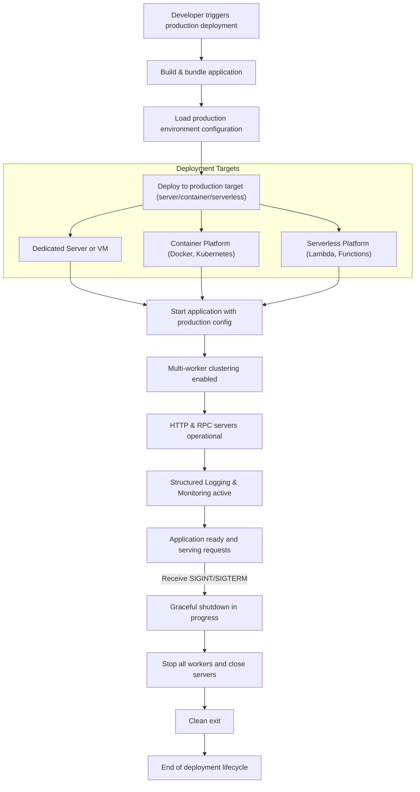

# Production Deployment Overview

Deploying your Deepkit Framework applications to production is a pivotal step in the lifecycle of your software—transforming code into a resilient, high-performing service accessible to your users. This overview guides you through the essential concepts, workflows, architectural patterns, and deployment targets tailored to Deepkit applications, ensuring your deployment is reliable, observable, and maintainable.

---

## Understanding Production Deployment with Deepkit

At its core, deploying a Deepkit app to production means running the app’s CLI-driven entry point configured for a production environment. This involves launching your application server (HTTP/RPC), managing configuration for stability, and selecting deployment infrastructures that meet your availability and scalability needs.

Deepkit’s modular architecture and built-in multi-worker support simplify creating production-ready systems without deep infrastructure complexity.

<Tip>
Production deployment is not just about starting the server but about building a robust, observable, and manageable environment for your application to thrive under real user loads.
</Tip>


## Workflow Options for Production Deployment

### 1. Single Process Deployment

Ideal for small or low-traffic applications. Run the Deepkit app CLI command that starts the HTTP server in a single Node.js process.

This is straightforward:

```sh
node app.ts server:start
```

- Best for: Development, staging, or low-demand production setups
- Limitations: No built-in scalability or failover

### 2. Multi-Worker Cluster Deployment

Deepkit Framework’s application server supports multi-worker clustering out of the box, enabling you to leverage all CPUs on your machine.

The configured number of workers will be forked and managed, with automatic restart upon unexpected exits.

Configure this in your `FrameworkModule` or app configuration:

```typescript
new FrameworkModule({
  workers: 4, // Number of worker processes
  // other settings
});
```

- Benefits:
  - Horizontal scaling on a single host
  - Fault tolerance via worker restarts
- Usage:
  - Start as usual; Deepkit handles worker lifecycle and load balancing

### 3. Containerized Deployments

Running your Deepkit app in Docker or container orchestration platforms (Kubernetes, Docker Swarm, etc.) aligns perfectly with the multi-worker or single worker model.

Common patterns include:

- Building a Docker image using your app source,
- Passing environment variables for production configs,
- Using container restarts and health checks for reliability.

<Tip>
Ensure environment variables like `NODE_ENV=production` and Deepkit-specific config are injected during container runtime.
</Tip>

### 4. Serverless and Functions

While Deepkit is optimized for server and cluster deployments, it can be adapted to serverless platforms by invoking CLI commands as functions or containers.

Considerations:
- Manage application startup latency
- Stateless design
- Externalize sessions and storage


## Architectural Patterns for Production

Deepkit applications leverage CLI-based startup — your `app.ts` typically combines CLI commands, controllers, and service providers.

Key architectural considerations:

- **Configuration Management:** Use environment files (`production.env`) and config classes to separate production from dev settings.

- **Multi-Process Load Balancing:** Utilize Deepkit’s cluster management for CPUs.

- **Graceful Shutdown & Signals:** Deepkit listens on common signals (`SIGINT`, `SIGTERM`) to shutdown cleanly.

- **Logging & Observability:** Use JSON transport logging in production for structured logs.

- **Debugging & Profiling:** Disable debug mode for production for performance and security.

### Example Production App Setup

```typescript
new App({
    config: AppConfig,
    controllers: [...],
    imports: [new FrameworkModule({ debug: false, workers: 4 })]
})
.loadConfigFromEnv({ envFilePath: ['production.env'] })
.setup((module, config) => {
    if (config.environment === 'production') {
        module.configureProvider<Logger>(logger => logger.setTransport([new JSONTransport()]));
    }
})
.run();
```


## Typical Deployment Targets

### Dedicated Servers or VMs

Run your Deepkit application directly on Linux servers or virtual machines. Use process managers like `pm2`, `systemd`, or `forever` to manage uptime.

- Set up environment variables and `.env` files
- Use the multi-worker option to scale on hosts
- Use load balancers or reverse proxies (Nginx, HAProxy) if exposing multiple services or handling SSL termination

### Container Platforms

Build container images embedding your application and runtime:

- Optimize image size
- Inject environment variables
- Health check endpoints
- Restart policies

Use Kubernetes or Docker Swarm to:

- Scale containers
- Manage deployments and rollbacks
- Enable logging and metrics collection

### Serverless Platforms

If adapting Deepkit to serverless (AWS Lambda, Azure Functions), use your CLI commands as handlers. Architect stateless services.

### Hybrid Deployments

Combine local and cloud deployments or mix containerized and non-containerized hosts for flexibility.


## Key Considerations for Reliability, Observability, and Maintenance

### Reliability

- **Multi-worker clustering** to maximize CPU usage and fault tolerance
- **Graceful shutdown:** Deepkit listens for `SIGINT` and `SIGTERM` signals, allowing in-flight requests to finish
- **Automatic restarts:** Workers restart in case of crashes

### Observability

- Structured JSON logging with `JSONTransport` for log aggregation
- Enable production monitoring on Kubernetes or servers using standard tools
- Use Deepkit’s debug and profiling tools during development but disable them in production

### Maintenance

- Enable hot reload carefully (not recommended in production)
- Design configuration and secrets management for automated, secure updates
- Plan maintenance windows considering graceful shutdowns


## Troubleshooting Common Production Issues

<AccordionGroup title="Troubleshooting Production Deployments">
<Accordion title="App Won't Start or Crashes Immediately">

- Check logs for exceptions
- Ensure all environment variables and configuration files are present
- Validate the production environment (Node.js version, dependencies)
- Use process manager logs or container logs

</Accordion>
<Accordion title="Worker Processes Not Starting">

- Verify `workers` config is set correctly
- Ensure no port conflicts
- Check for cluster setup errors

</Accordion>
<Accordion title="Requests Not Reaching Application">

- Confirm network/firewall settings
- Check reverse proxy or load balancer configurations
- Validate server listening ports match configuration

</Accordion>
<Accordion title="Logging is Not Structured or Missing">

- Confirm `Logger` transport is set to `JSONTransport` in production mode
- Verify log destinations are configured correctly

</Accordion>
</AccordionGroup>


## Next Steps

- Configure [Environment Configuration](environment-configuration.md) for production variables
- Automate deployment with [Deployment Automation & Containerization](deployment-automation.md)
- Ensure robust [Monitoring and Logging](monitoring-and-logging.md) for production observability
- Plan for [Scaling and High Availability](scaling-and-high-availability.md) for load growth


---

## Diagram: High-Level Production Deployment Workflow




---

Deepkit Production Deployment is designed with simplicity and flexibility to empower you to bring your applications to the real world with confidence and control. Use the modular features, multi-worker support, and robust CLI to tailor your deployment for your unique production needs.


---

## References

- [Deepkit Framework Module Documentation](./framework.md)
- [Deepkit App CLI & Configuration](./app.md)
- [Environment Configuration Guide](./environment-configuration.md)
- [Deployment Automation & Containerization](./deployment-automation.md)
- [Monitoring and Logging](./monitoring-and-logging.md)
- [Scaling and High Availability](./scaling-and-high-availability.md)


---

For example production deployment scenarios and best practices, refer to the Guides and Deployment sections in the complete Deepkit documentation.

---