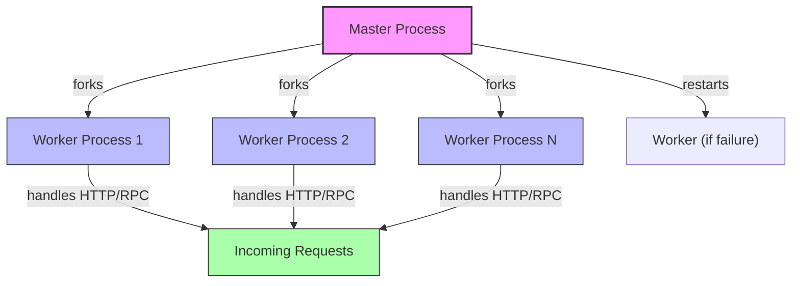

# Scaling and High Availability

Deepkit Framework empowers you to build scalable, resilient, and highly available applications with ease. This guide focuses on strategies specifically for scaling Deepkit services horizontally and vertically while maintaining operational excellence.

Whether you're scaling out across multiple machines or maximizing resources on a single host, Deepkit offers flexible options like clustering, container orchestration support, stateless design patterns, and multi-process configurations to ensure your application performs reliably under load.

---

## Why Focus on Scaling and High Availability?

Your users expect uninterrupted, fast responses—even as your application demand grows. This chapter ensures you can confidently increase capacity while minimizing downtime and bottlenecks. By applying these strategies, your Deepkit services will handle increased traffic, recover gracefully from failures, and maintain consistent performance.

---

## 1. Horizontal Scaling Strategies

Horizontal scaling means running multiple instances of your application across different processes or machines. Deepkit Framework provides native support for such architecture through clustering and container orchestration patterns.

### 1.1 Clustering Using Node.js Cluster Module

- **Multi-Worker Setup:** Deepkit’s `ApplicationServer` supports running multiple worker processes in parallel, utilizing Node.js clustering internally.
- **Master-Worker Pattern:** The main process forks workers whose primary role is to handle incoming HTTP or RPC requests.
- **Automatic Worker Management:** If a worker dies unexpectedly, the master automatically spawns a replacement ensuring minimal service disruption.

**How to Enable:**
Set the `framework.workers` configuration value to the number of desired worker processes (often set to the number of CPU cores). For example:

```typescript
import { FrameworkModule } from '@deepkit/framework';

const app = new App({
  imports: [new FrameworkModule({
    workers: 4 // scales app across 4 processes
  })]
});
```

The application server takes care of load balancing between workers and gracefully shutting them down when necessary.

### 1.2 Container Orchestration

Deepkit services are designed to run seamlessly within container environments such as Docker Compose and Kubernetes.

- **Stateless Services:** Deepkit applications can be deployed as stateless containers, making them ideal for horizontal scaling using orchestration tools.
- **Health Checks & Rolling Updates:** Container orchestrators manage health probes, scaling policies, and incremental upgrades without downtime.

**Best Practices:**
- Keep your Deepkit app stateless or use external shared resources (databases, caches, message brokers) for stateful needs.
- Use Kubernetes readiness and liveness probes to ensure reliable service replacement.
- Leverage environment-specific configuration (via environment variables or configuration classes) to adapt instances to their environment.

### 1.3 Multi-Process and Worker Clustering Flow



---

## 2. Vertical Scaling Strategies

Vertical scaling focuses on optimizing resource usage within a single process or machine.

### 2.1 Multi-Process Use for Concurrency

Deepkit’s `ApplicationServer` and worker processes enable you to maximize CPU utilization effectively within one host by running multiple app instances in parallel.

### 2.2 Efficient Memory and CPU Use

- Use Deepkit’s built-in profilers and debuggers to identify bottlenecks.
- Tune Node.js garbage collection with environment flags if necessary.
- Enable compression carefully to balance CPU and bandwidth.

### 2.3 Stateless Application Design

Building your Deepkit services statelessly amplifies vertical scaling benefits:

- Avoid server-side session storage; use external session stores if needed.
- Ensure requests can be handled independently by any worker instance.

---

## 3. Best Practices for Performance and Resilience

### 3.1 Utilize Containerization

Package your Deepkit services in containers for rapid scaling and environment consistency.

### 3.2 Use Shared External Resources

Keep databases, caches, brokers, and file storage external to your application cluster to enable easy scaling and failover.

### 3.3 Implement Monitoring and Alerts

Make use of Deepkit’s logging and event listeners to monitor your application’s health across scaled instances. Connect with external monitoring tools for metrics aggregation.

### 3.4 Graceful Shutdowns

Deepkit supports graceful worker shutdowns to safely complete in-flight requests before termination, ensuring no data loss or client errors during scaling events.

### 3.5 Load Balancing

In clustered or container environments, employ external load balancers or orchestrator-managed service discovery to distribute incoming requests evenly across workers or pods.

---

## 4. Step-by-Step: Scaling Your Deepkit Application Horizontally

<Steps>
<Step title="Step 1: Configure Workers">
Define the number of worker processes in your FrameworkModule configuration.

```typescript
new FrameworkModule({ workers: 4 })
```
</Step>
<Step title="Step 2: Deploy as Containers">
Prepare a Dockerfile for your Deepkit application and use your container platform (Docker Compose, Kubernetes) to run multiple replicas.
</Step>
<Step title="Step 3: Maintain Statelessness">
Store session state externally, e.g., Redis or database, to avoid sticky sessions and enable clean scaling.
</Step>
<Step title="Step 4: Implement Health Checks">
Configure readiness and liveness probes in your orchestration platform.
</Step>
<Step title="Step 5: Monitor">
Set up centralized logging and metrics to observe and react to load changes.
</Step>
<Step title="Step 6: Manage Rolling Updates">
Employ orchestrator strategies for zero-downtime deployments.
</Step>
</Steps>

---

## 5. Troubleshooting Common Scaling Issues

<AccordionGroup title="Common Challenges and Solutions">
<Accordion title="Worker Process Crashes and Restarts">
- Cause: Unhandled exceptions or resource exhaustion.
- Solution: Use Deepkit’s diagnostic hooks to capture errors. Adjust resources and monitor logs. Adjust max listeners or increase memory limits if needed.
</Accordion>
<Accordion title="Load Balancer Not Distributing Requests Evenly">
- Cause: Misconfigured health checks or sticky sessions.
- Solution: Ensure each worker properly responds to health probes. Avoid session affinity unless absolutely necessary.
</Accordion>
<Accordion title="Slow Response under Load">
- Cause: CPU saturation or blocking operations.
- Solution: Profile your app, offload heavy computations, increase worker count or scale out.
</Accordion>
<Accordion title="Issues with Statelessness and Session Management">
- Cause: Storing sessions in-memory in individual workers.
- Solution: Switch to external session store like Redis. Use Deepkit’s session handling hooks properly.
</Accordion>
</AccordionGroup>

---

## 6. Summary

Scaling Deepkit applications involves leveraging its native multi-worker architecture, designing stateless services, and deploying with modern container orchestration platforms. Vertical scaling through resource optimization complements horizontal scaling through clustering and containers, enabling robust, performant, and highly available backend services.

By following the outlined steps and best practices, you will equip your Deepkit applications to confidently handle growth and maintain resilience in production environments.

---

## Related Resources

- [Production Deployment Overview](/deployment/deploying-to-production/production-deployment-overview)
- [Environment Configuration](/deployment/deploying-to-production/environment-configuration)
- [Monitoring and Logging](/deployment/operational-excellence/monitoring-and-logging)
- [Deepkit Application Server API](https://github.com/deepkit/deepkit-framework/blob/main/packages/framework/src/application-server.ts)
- [Deepkit Framework Module](https://github.com/deepkit/deepkit-framework/blob/main/packages/framework/src/module.ts)

---