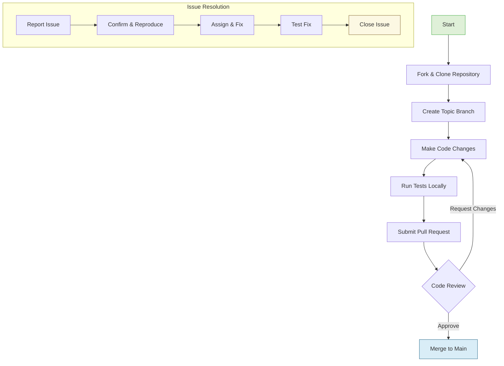

# Contributing and Reporting Issues

Welcome to the gateway for improving Deepkit Framework. This page guides you through how to contribute code, report bugs effectively, and submit improvements like FAQs. Whether you're fixing a critical bug, adding a new feature, or sharing valuable community knowledge, this page lays out the development process and points you to detailed contribution documents.

---

## Why Contribute?

Your contributions help Deepkit evolve faster, become more stable, and serve the community better. By participating, you join a robust ecosystem with clear guidance, code reviews, and an emphasis on quality. Every bug report or pull request brings you closer to mastering the Deepkit development workflow while making the framework stronger for everyone.

---

## How to Contribute Code

### 1. Prepare Your Environment
- Set up your local Deepkit development environment following the official **Development Setup** guide.
- Ensure you have the required Node.js version and dependencies installed.

### 2. Fork and Clone the Repository
- Fork Deepkit Framework's repository on GitHub.
- Clone your fork locally.

### 3. Create a Topic Branch
- Use descriptive branch names related to your feature or fix.
- Example: `fix/http-controller-error-handling` or `feature/cli-command-enhancements`.

### 4. Make Your Changes
- Write clear, maintainable TypeScript code adhering to Deepkit's coding conventions.
- Add unit tests and documentation updates if applicable.

### 5. Run Tests and Validate
- Run existing and new tests locally to ensure no regressions.
- Use provided scripts for linting and formatting.

### 6. Submit a Pull Request
- Follow the PR template, providing a concise description of your changes.
- Link related issues or feature requests.

<Tip>
Always check the existing issues and open PRs to avoid duplication. Engage in discussion early if your change impacts core components.
</Tip>

---

## Reporting Issues Effectively

Clear, actionable bug reports accelerate resolution. Follow these best practices when submitting issues:

### What to Include:
- **Descriptive Title:** Summarize the problem precisely.
- **Steps to Reproduce:** Detailed step-by-step instructions or a minimal reproducible example.
- **Expected vs Actual Behavior:** Clarify what you expected and what happened instead.
- **Environment Details:** Node.js version, OS, Deepkit version, and any relevant configuration.
- **Logs and Error Messages:** Full error stacks or console output.

### Where to Report:
- Use the official [Deepkit GitHub Issues page](https://github.com/deepkit/deepkit-framework/issues) to submit bugs.

<Tip>
Providing minimal, isolated examples using Deepkit’s sample apps or snippets greatly speeds up diagnosis.
</Tip>

---

## Submitting FAQs and Documentation Improvements

Community-driven FAQs help everyone learn faster. You can contribute questions and answers by:

- Joining the Deepkit Discord and interacting with the bot.
- Posting well-formed questions or answers in the community forums.
- Submitting pull requests for FAQ documentation updates using the contribution process.

<Tip>
Focus on frequently encountered issues or insightful usage examples to maximize impact.
</Tip>

---

## Key Contribution Resources

- **Development Setup Guide:** Detailed instructions on environment setup and building Deepkit.
- **Contribution Guidelines:** Coding standards, commit message conventions, and pull request best practices.
- **Code of Conduct:** Community behavior expectations and how to report misconduct.
- **Issue Templates:** Predefined templates to guide your bug or feature requests.

---

## Development Process Overview

A simplified workflow of contributing and issue handling:

This flow ensures contributions are thoroughly reviewed and issues are resolved systematically.

---

## Best Practices and Tips

- **Communicate Early:** Discuss significant changes in issues or discussions before implementation.
- **Keep Changes Focused:** One PR per feature or fix promotes easier review.
- **Write Clear Commit Messages:** Explain why the change was made, not just what was done.
- **Stay Updated:** Sync your fork with the main repository frequently to avoid conflicts.
- **Respect the Code of Conduct:** Maintain professionalism and respect in all interactions.

---

## Troubleshooting Contribution Issues

### Common Problems
- **Build Failures:** Verify correct Node.js version and dependencies.
- **Test Failures:** Review recent changes carefully, ensure all tests pass before PR.
- **Merge Conflicts:** Pull latest changes from main branch into your topic branch.
- **Linter Errors:** Run formatting and lint scripts prior to submission.

<Tip>
Refer to the Troubleshooting Common Issues documentation for detailed guidance.
</Tip>

---

## Getting Help

If you encounter roadblocks, use these resources:

- **Discord:** Join the Deepkit Discord server to chat with maintainers and community.
- **GitHub Discussions:** Ask questions and participate in discussions.
- **Documentation:** Extensive guides on architecture, APIs, and core concepts.

---

By following this guide, you can contribute confidently and efficiently to the Deepkit Framework. Your involvement strengthens this growing ecosystem and helps deliver a better developer experience.

---

### Related Documentation

- [Development Setup Guide](https://github.com/deepkit/deepkit-framework/blob/main/CONTRIBUTING.md) - How to prepare your local environment
- [Troubleshooting Common Issues](https://docs.deepkit.com/getting-started/troubleshooting-next-steps/common-issues) - Fix build and setup problems
- [Community Support & Where to Get Help](https://docs.deepkit.com/faq/community-support-faq/where-to-get-help) - Official communication channels
- [Core Concepts & Architecture](https://docs.deepkit.com/overview/architecture-core-concepts/core-concepts) - Understand Deepkit’s design

---

Thank you for your interest in improving Deepkit Framework!
