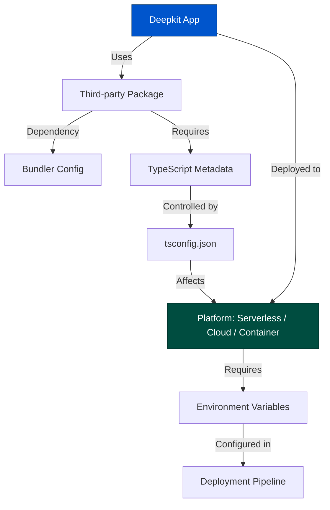

# Integration and Compatibility Troubleshooting

This page provides practical solutions for overcoming challenges when connecting Deepkit Framework to third-party tools, integrating community packages or adapters, and deploying your application across diverse environments such as serverless platforms, REST or GraphQL APIs, and cloud infrastructures.

Focus here is to help you quickly identify and resolve common integration and compatibility issues to ensure your Deepkit applications run smoothly in varied operational contexts.

---

## 1. Common Integration Challenges

### Why do some third-party packages or adapters fail with Deepkit?

Third-party tools and community packages may sometimes have compatibility issues due to differences in runtime expectations, dependencies, or how decorators and metadata are processed. Common causes include:

- Missing or incompatible TypeScript compiler options such as `emitDecoratorMetadata` or `experimentalDecorators`.
- Conflicts in runtime type reflection or metadata usage.
- Dependency mismatches, especially around versions of peer packages like `reflect-metadata`.
- Differences in module resolution strategies or bundling configurations.

### What to check first?

1. **Compiler Configuration:** Make sure your `tsconfig.json` aligns with Deepkit’s recommended settings, including `experimentalDecorators`, `emitDecoratorMetadata`, and `moduleResolution: "node"`.

2. **Dependency Versions:** Verify all dependencies and peer dependencies are compatible, avoiding installing duplicate or conflicting versions.

3. **Runtime Environment:** Confirm that the Node.js version and environment support necessary features for decorators and reflection.

4. **Community Package Status:** Check if the third-party package explicitly supports Deepkit or if known issues exist.

5. **Import Statements:** Use ES module imports consistently to match Deepkit’s expectations.

---

## 2. Troubleshooting Deployment Across Platforms

### Deploying on Serverless Platforms (AWS Lambda, Azure Functions, etc.)

- **Cold Start Delays:** Deepkit apps are optimized for performance, but initial startup in serverless functions might be slower due to runtime type compilation. Consider using warmup strategies or minimal imports.

- **Bundling Issues:** Serverless environments typically require bundlers (e.g., Webpack, esbuild). Ensure your bundler correctly processes decorators and TypeScript metadata.

- **Environment Variables:** Confirm that configuration overrides from environment variables are properly loaded during startup, using the recommended Deepkit configuration schema.


### Deploying for REST or GraphQL API Backends

- Verify HTTP controllers and middleware are registered correctly through the `FrameworkModule`.
- Check compatibility of third-party middleware adapters that might rely on Express.js or other frameworks. Use Deepkit’s `HttpModule` and middleware layers for integration instead.
- For GraphQL, ensure your resolver layers correctly interface with Deepkit’s dependency injection and validation system.


### Cloud and Container Deployments

- Ensure your container image includes all necessary dependencies and build artifacts.
- Configure ports, environment variables, and storage volumes properly in your orchestrator (Kubernetes, Docker Swarm).
- Use health checks and logging integrations to monitor your Deepkit app’s status.

---

## 3. Solutions for Community Package & Adapter Issues

### Scenario: Runtime Reflection / Metadata Not Working

Some packages depend on runtime reflection which Deepkit supports via TypeScript decorators. To fix:

- Confirm that your `tsconfig.json` enables `emitDecoratorMetadata` and `experimentalDecorators`.
- Ensure the package does not override or conflict with Deepkit’s reflection system.
- If using ESBuild or other bundlers, configure plugins to preserve decorator metadata.


### Scenario: Package Uses Unsupported or Incompatible Decorators

- Review whether Deepkit’s runtime types can be mapped or translated.
- Explore extending Deepkit with a custom adapter module to bridge gaps.


### Scenario: Adapter or Package Throws Dependency Injection Errors

- Verify that the service providers and dependencies are correctly registered in Deepkit modules.
- Check constructor signatures for possible mismatches with Deepkit’s DI container.
- Avoid mixing multiple DI containers in the same app.

---

## 4. Best Practices for Seamless Integration

- **Adhere to Deepkit Compiler Settings:** Always use Deepkit-recommended TS compiler options.
- **Use Deepkit Modules and Providers:** Register external integrations as providers via modules for clean dependency injection.
- **Validate Early:** Use Deepkit’s runtime type validation at integration points to catch issues early.
- **Isolate Third-Party Code:** Encapsulate third-party integrations in separate modules to minimize impact.
- **Stay Updated:** Monitor Deepkit and community package updates that address compatibility.

---

## 5. Step-by-Step: Resolving a Common Integration Issue

**Problem:** You integrated a third-party library that uses decorators but get an error about missing metadata or injection failure.

<Steps>
<Step title="Step 1: Verify tsconfig.json settings">
Check `experimentalDecorators` and `emitDecoratorMetadata` are enabled.
</Step>
<Step title="Step 2: Confirm consistent TypeScript and package versions">
Make sure all dependencies use a compatible TypeScript version and no conflicting `reflect-metadata` versions.
</Step>
<Step title="Step 3: Inspect bundler configuration">
If using Webpack, esbuild, or other bundlers, configure them to preserve decorators and metadata.
</Step>
<Step title="Step 4: Isolate integration point">
Wrap third-party instantiation in a Deepkit-provided service or module provider.
</Step>
<Step title="Step 5: Use Deepkit Debugger to inspect dependency graph">
Use the Deepkit Debugger to check service registration and module imports.
</Step>
<Step title="Step 6: Rebuild and retest">
Recompile your app and verify behavior in a clean environment.
</Step>
</Steps>

---

## 6. Troubleshooting Quick Reference

<AccordionGroup title="Common Integration and Deployment Issues">
<Accordion title="Error: Missing decorator metadata at runtime">
- Enable `emitDecoratorMetadata` and `experimentalDecorators` in your `tsconfig.json`.
- Avoid mixing ES5 and ES6 module syntax.
- Check bundler config if applicable.
</Accordion>
<Accordion title="Dependency injection failures on third-party types">
- Verify the providers are registered properly.
- Inspect constructor parameters for missing types or circular dependencies.
</Accordion>
<Accordion title="Third-party package incompatible with Deepkit’s runtime types">
- Check if a compatible adapter module exists.
- Consider creating custom wrapper services.
</Accordion>
<Accordion title="Deployment errors in serverless environments">
- Confirm that all native dependencies are packaged.
- Use minimal imports to reduce bundle size.
- Monitor cold start with warmup strategies.
</Accordion>
<Accordion title="Configuration not loaded in cloud or container deployments">
- Confirm environment variables follow Deepkit’s expected format.
- Use `.env` files or container environment settings correctly.
</Accordion>
</AccordionGroup>

---

## 7. Where to Go from Here

- Review [Deepkit Libraries & Ecosystem](overview/integration-and-ecosystem/ecosystem-libraries) for officially supported adapters.
- Use [Integrating with Other Systems](overview/integration-and-ecosystem/external-integration) guide for general integration patterns.
- Consult [Troubleshooting Common Issues](getting-started/troubleshooting-next-steps/common-issues) for environment and installation problems.
- Explore the [Deepkit Debugger](library/framework) for inspecting modules and dependencies interactively.


<Tip>
Effective integration and deployment troubleshooting involves validating your build toolchain, verifying compatibility of third-party packages with Deepkit’s runtime types and DI container, and leveraging Deepkit’s modular architecture to isolate integration points. Always start from your `tsconfig.json` and build configuration, then methodically escalate to runtime inspection and refactoring integration modules.
</Tip>

<Info>
Deepkit's emphasis on runtime types and TypeScript compiler integration means most compatibility issues trace back to metadata emission and decorator support - checking these settings resolves the majority of problems.
</Info>

---

### Additional Resources

- [Deepkit Framework Overview](overview/introduction-and-value/product-intro)
- [Integration Patterns](concepts/integration-and-interoperability/integration-patterns)
- [Configuration Basics](getting-started/first-app-setup/configuration-basics)
- [Troubleshooting Common Issues](getting-started/troubleshooting-next-steps/common-issues)
- [Deepkit ORM and Database Integration](guides/real-time-apis-and-integrations/database-integration)


---

_For detailed, personalized support, consider reaching out on the official Deepkit Discord community or creating an issue on the project repository._

---

## Appendix: Sample `tsconfig.json` Settings Recommended for Integration

```json
{
  "compilerOptions": {
    "target": "es2020",
    "module": "CommonJS",
    "moduleResolution": "node",
    "experimentalDecorators": true,
    "emitDecoratorMetadata": true,
    "strict": true,
    "skipLibCheck": true
  }
}
```

---

### Visualizing Integration Flow (High-Level)



---