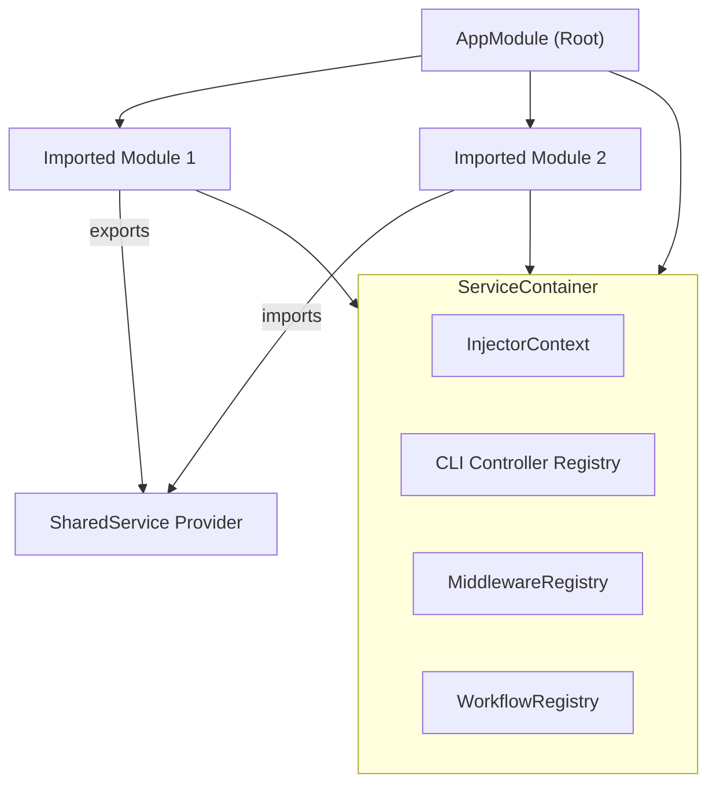

# Designing Modular Applications

Master the Deepkit module system to effectively structure and scale your applications by breaking them into logical, reusable components. This guide walks you through defining modules, registering services and controllers, managing dependencies between modules, and using module hooks to customize behavior.

---

## 1. Overview

### What This Guide Helps You Achieve
You will learn how to design your application with modularity in mind, creating well-encapsulated feature units with configuration, services (providers), controllers, event listeners, and dependencies that can be composed and reused across your application.

### Prerequisites
- Familiarity with TypeScript.
- Basic understanding of dependency injection and service containers.
- Have Deepkit Framework installed and a project initialized.

### Expected Outcome
By the end, you will be able to:
- Define both class-based and functional modules.
- Register providers, controllers, and event listeners inside modules.
- Manage module imports, exports, and configuration schemas.
- Use lifecycle hooks like `process`, `processProvider`, and `postProcess` for advanced setup.
- Compose complex applications with clear dependency boundaries.

### Time Estimate
Approximately 20 to 30 minutes to read and practice this guide.

### Difficulty Level
Intermediate

---

## 2. Designing Modules Step-by-Step

### Step 1: Define a Module

You can define a module either as a class extending from `createModuleClass` or as a functional module.

#### Class Module Example
```typescript
import { createModuleClass } from '@deepkit/app';

export class MyModule extends createModuleClass({
  providers: [MyService],
  controllers: [MyController],
}) {}
```

#### Functional Module Example
```typescript
import { AppModule } from '@deepkit/app';

export function myModule() {
  return (module: AppModule) => {
    module.addProvider(MyService);
    module.addController(MyController);
  };
}
```

### Step 2: Add Providers and Controllers

- **Providers** are services that your application requires (e.g., database service, business logic).
- **Controllers** handle specific tasks such as HTTP requests or CLI commands.

Register them inside your module either via constructor options or by adding them directly.

Example:
```typescript
class HelloWorldService {
  hello() {
    return 'Hello World!';
  }
}

class MyController {
  constructor(private helloService: HelloWorldService) {}

  greet() {
    return this.helloService.hello();
  }
}

export class MyModule extends createModuleClass({
  providers: [HelloWorldService],
  controllers: [MyController],
}) {}
```

### Step 3: Manage Dependencies Between Modules (Imports and Exports)

- Use **imports** to bring other modules into your module.
- Use **exports** to make certain providers available to importers.

Example:
```typescript
export class MyModule extends createModuleClass({
  providers: [MyService],
  exports: [MyService]
}) {}

export class AppModule extends createModuleClass({
  imports: [new MyModule()],
  controllers: [AppController],
}) {}
```

Remember: providers are encapsulated by default in the module, so exporting is necessary for access outside.

### Step 4: Define Configuration Schema

Modules can define typesafe configurations by providing a configuration class.

Example:
```typescript
export class Config {
  title!: string;  // Required
  debug: boolean = false;  // Optional with default
}

export class MyModule extends createModuleClass({
  config: Config,
  providers: [MyService]
}) {}
```

You can instantiate the module with configuration options that will be validated and injected:

```typescript
const module = new MyModule({ title: 'My App', debug: true });
```

### Step 5: Use Module Lifecycle Hooks

- `process()`: Adjust or add imports/providers/controllers after configuration validation but before DI container build.
- `processController()`: React when a controller is registered — for example, to detect HTTP or RPC controllers.
- `processProvider()`: React to provider registration — useful for automatic registrations or instrumentation.
- `postProcess()`: The last setup step before DI container is created, helpful for final setup.

Example of `process` hook:
```typescript
process() {
  if (this.config.debug) {
    this.addProvider(DebugService);
  }
  this.addImport(new AnotherModule({ option: 'value' }));
}
```

### Step 6: Instantiate and Compose Modules in Your Application

You can import modules into your root application `App` or other modules to compose features.

Example:
```typescript
new App({
  imports: [new MyModule({ title: 'Hello' })],
  controllers: [AppController],
}).run();
```

---

## 3. Practical Examples

### Example: Modular Greeting Application

```typescript
import { App, createModuleClass } from '@deepkit/app';

class GreetingConfig {
  greeting: string = 'Hello';
}

class GreetingService {
  constructor(public config: GreetingConfig) {}

  greet(name: string) {
    return `${this.config.greeting}, ${name}!`;
  }
}

class GreetingController {
  constructor(private service: GreetingService) {}

  sayHello(name: string) {
    return this.service.greet(name);
  }
}

export class GreetingModule extends createModuleClass({
  config: GreetingConfig,
  providers: [GreetingService],
  controllers: [GreetingController],
}) {}

const app = new App({
  imports: [new GreetingModule({ greeting: 'Hi' })]
});

app.run();
```

### Example: Dynamic Module Imports with `process`

```typescript
import { createModuleClass } from '@deepkit/app';

class FeatureConfig {
  enableExtra: boolean = false;
}

class ExtraFeatureModule extends createModuleClass({ providers: [ExtraService] }) {}

export class FeatureModule extends createModuleClass({ config: FeatureConfig }) {
  process() {
    if (this.config.enableExtra) {
      this.addImport(new ExtraFeatureModule());
    }
  }
}
```

---

## 4. Common Pitfalls & Troubleshooting

### Problem: Provider Not Accessible Outside Module

**Cause:** Forgot to export the provider in module exports.

**Solution:** Add the provider's token/class to the `exports` array or use `module.addExport(Provider)` in functional modules.

### Problem: Circular Dependencies Between Modules

**Cause:** Modules importing each other directly.

**Solution:** Refactor to extract common providers/controllers into a shared module.

### Problem: Configuration Not Applying

**Cause:** Module instance created without passing or configuring the options properly.

**Solution:** Pass config options in the constructor or use `.configure()` method on the module instance.

### Problem: Controller Not Registered

**Cause:** Module defining a controller but no module processes it (e.g., missing HTTP or RPC module import)

**Solution:** Ensure the processing module (e.g., HttpModule) is imported and listening to controller registrations.

---

## 5. Best Practices & Tips

- **Encapsulation:** Avoid exporting all providers; export only what consumers genuinely need.
- **Use Configuration Classes:** Always define configuration schema for modules to ensure type safety and clarity.
- **Leverage Hooks:** Use `process` and `postProcess` to dynamically modify modules based on config or environment.
- **Functional Modules for Lightweight Features:** Use functional modules for small or dynamic features.
- **Avoid `forRoot()` Unless Needed:** Prefer explicit exports/imports over pushing all services into the root injector.

---

## 6. Diagram: Module and Service Container Interaction




---

## 7. Next Steps & Related Topics

- Dive deeper into [Dependency Injection Basics](../core-workflows/dependency-injection-basics) to master service lifecycles and scopes.
- Explore [Configuration Basics](../../getting-started/first-app-setup/configuration-basics) for advanced config management.
- Learn about integrating HTTP and RPC Controllers to extend your modules' capabilities.
- Review the [Modules](../app/modules.md) chapter for additional module system insights.

---

## References
- [Deepkit App Modules Documentation](../app/modules.md)
- [Dependency Injection Guide](../core-workflows/dependency-injection-basics.md)
- [Configuration Basics](../../getting-started/first-app-setup/configuration-basics.md)
- [Deepkit Framework Overview](../framework.md)

---

<Tip>
Modules allow you to encapsulate features cleanly, so always strive for logical and reusable units.
Using module hooks properly unlocks powerful customization opportunities.
</Tip>

<Warning>
Avoid circular module dependencies; they can cause runtime errors and confusing injection problems.
</Warning>

<Info>
Register at least one processing module (like FrameworkModule or HttpModule) in your root App to enable controller processing.
</Info>

<Check>
Remember to export providers explicitly to share them outside their defining module.
</Check>