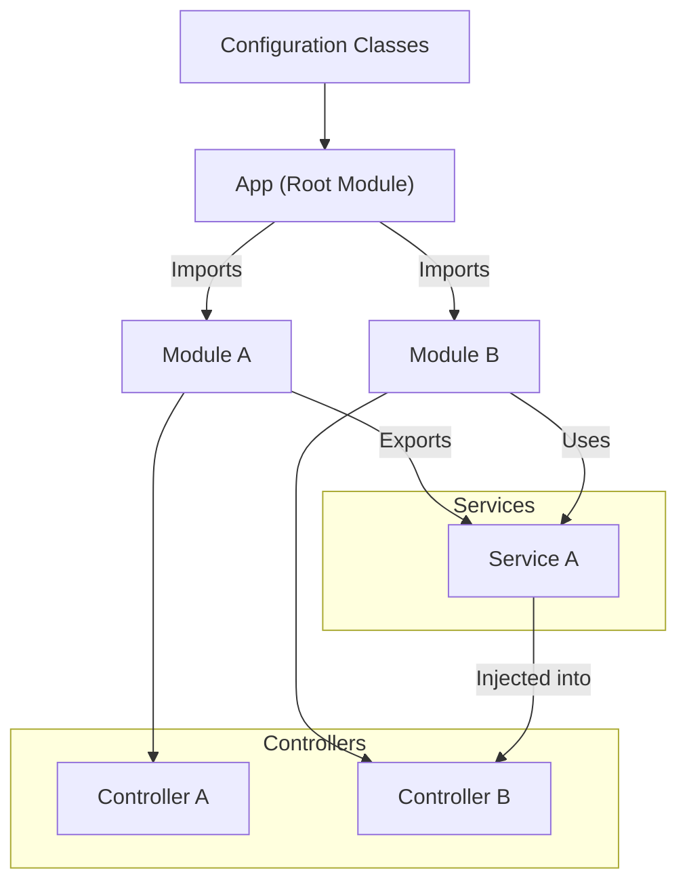

# Understanding Project Structure

Explore the core anatomy of a Deepkit project: services, controllers, modules, and configuration. This guide introduces the file layout and the role of each major component in keeping your codebase maintainable.

---

## 1. Overview of Deepkit Project Structure

When you begin working with Deepkit, understanding how your project is structured is foundational. Your project consists of several key components that together create a clean, maintainable, and scalable application:

- **Modules**: Self-contained building blocks encapsulating providers, controllers, listeners, and configuration.
- **Services / Providers**: The essential business logic units—usually classes—registered to dependency injection.
- **Controllers**: Handle different types of incoming requests or commands (HTTP, CLI, RPC).
- **Configuration**: Strongly typed settings classes that configure modules and providers.

By organizing your project around these components, Deepkit promotes a modular design where distinct concerns are separated cleanly, making your code easier to develop and maintain.

---

## 2. File Layout and Anatomy

While your actual project file layout can vary, a common and practical arrangement aligns with Deepkit conventions:

```
project-root/
├── src/
│   ├── config.ts          # Configuration classes
│   ├── services/          # Service classes (business logic)
│   ├── controllers/       # HTTP, CLI, RPC controllers
│   ├── modules/           # Custom modules
│   └── database/          # Database schemas and ORM logic
├── app.ts                 # Application entry point, application module
├── package.json
└── tsconfig.json
```

### Role of Each Directory

- **`config.ts`**: Defines configuration classes for your app or modules. These classes provide the schema for loading environment variables or JSON configs.
- **`services/`**: Contains service classes that perform business logic. Each service is registered as a provider in modules or the application.
- **`controllers/`**: Includes controllers for handling inputs:
  - **HTTP Controllers** using decorators
  - **CLI Controllers** for command-line interactions
  - **RPC Controllers** for RPC calls
- **`modules/`**: Houses application modules which bundle related providers, controllers, and configuration into cohesive units.
- **`database/`**: Manages database entities and migrations.
- **`app.ts`**: The starting point where the root application module is defined and the Deepkit `App` is created.

---

## 3. Key Components in Detail

### 3.1 Modules

Modules in Deepkit group providers, controllers, listeners, workflows, and configuration. They act as encapsulated units with their own dependency injection sub-container.

- **Creation**: Modules can be created by extending from `createModuleClass` or as functional modules.

```typescript
import { createModuleClass } from '@deepkit/app';

export class MyModule extends createModuleClass({
    providers: [MyService],
    controllers: [MyController],
    config: MyConfig,
    exports: [MyService],
}) {}
```

- **Encapsulation**: Providers are private to the module unless explicitly exported.
- **Imports and Exports**: Modules can import other modules, and selectively export providers to make them available to importing modules.

### 3.2 Services (Providers)

Services represent the core functionality — think data managers, business logic handlers.

- Registered in modules or the app via `providers`.
- Become singleton instances automatically managed by the DI container.

Example:

```typescript
export class UserManager {
  private users: User[] = [];

  addUser(user: User) {
    this.users.push(user);
  }
}

new App({
  providers: [UserManager],
}).run();
```

### 3.3 Controllers

Controllers handle external interactions:

- **HTTP Controllers:** Use decorators such as `@http.GET` to define routes.
- **CLI Controllers:** Classes or commands mapped to CLI actions.
- **RPC Controllers:** Define remote procedure calls.

Controllers must be registered in the module or app’s `controllers` list.

Example HTTP controller snippet:

```typescript
import { http } from '@deepkit/http';

class MyController {
  @http.GET('/hello')
  hello() {
    return 'Hello World';
  }
}

new App({
  controllers: [MyController],
}).run();
```

### 3.4 Configuration

Configuration in Deepkit is strongly typed using classes. This setup promotes validation, autocompletion, and clarity.

- Typically, you create a `Config` class with fields defining app settings.
- These classes can have default values and validation.
- Configurations can be injected into services or controllers by referencing the class’s properties.

Example:

```typescript
class Config {
  domain: string = 'localhost';
  port: number = 8080;
}

new App({
  config: Config
});
```

---

## 4. Building and Maintaining the Project Structure

To keep your project clean and sustainable:

- **Group related services and controllers into modules.** This helps isolate features.
- **Export only those providers that should be shared.** Avoid leaking internal services.
- **Use config classes for all environment/configuration data.** Keeps configuration scalable and typed.
- **Follow naming conventions** (e.g., `*Service.ts` for services, `*Controller.ts` for controllers).
- **Use the `process()` hook in modules to add dynamic provider/controller logic** based on config.

---

## 5. Practical Example: Setting Up a Simple Module and App Structure

```typescript
import { App } from '@deepkit/app';
import { createModuleClass } from '@deepkit/app';
import { http } from '@deepkit/http';

// 1. Service
export class GreetingService {
  greet(name: string): string {
    return `Hello, ${name}!`;
  }
}

// 2. HTTP Controller
class GreetingController {
  constructor(private greetingService: GreetingService) {}

  @http.GET('/greet/:name')
  greet(name: string) {
    return this.greetingService.greet(name);
  }
}

// 3. Configuration
class AppConfig {
  port: number = 8080;
}

// 4. Module bundling everything
class GreetingModule extends createModuleClass({
  providers: [GreetingService],
  controllers: [GreetingController],
  config: AppConfig,
}) {}

// 5. Main App
const app = new App({
  imports: [new GreetingModule()],
});

app.run();
```

---

## 6. Tips & Best Practices

- **Keep modules focused and small.** Large monolithic modules can impede maintainability.
- **Use dependency injection to manage services lifecycle.** Avoid manual instantiation.
- **Leverage configuration classes for environment-aware setups.**  Use environment variables or `.env` files to tweak configurations.
- **Register all HTTP/CLI/RPC controllers explicitly.** Deepkit processes these during app setup.
- **Use `process()`, `postProcess()`, and lifecycle hooks to fine-tune your module behavior.**

---

## 7. Troubleshooting Common Issues

<AccordionGroup title="Common Issues">
<Accordion title="Services Not Available via Dependency Injection">
Make sure your service is registered in the module or app's `providers` section and not only declared. Also confirm that the provider is exported if consumed outside the module.
</Accordion>
<Accordion title="Controllers Not Responding to Requests">
Verify controllers are registered in the `controllers` array of the module or app. Confirm you have imported the related HTTP or CLI module that processes the controllers.
</Accordion>
<Accordion title="Configuration Not Loaded or Incorrect">
Ensure your config class is registered to the app/module via `config`. Also check environment variables or dotfiles are correctly set and that the config class's default values align with expected types.
</Accordion>
<Accordion title="Module Providers Not Shared Across Modules">
Providers are encapsulated by default in modules. To share across modules, you need to export the provider from its module and import the module where you want to use it.
</Accordion>
</AccordionGroup>

---

## 8. Visualizing the Deepkit Project Structure



This diagram demonstrates how the root app imports multiple modules, services are encapsulated or shared via exports, and controllers consume services through dependency injection.

---

## 9. Next Steps

To continue your Deepkit learning journey, explore these guides:

- [Creating Your First Deepkit App](https://docs.deepkit.com/guides/getting-started/create-new-app)
- [Working with Dependency Injection](https://docs.deepkit.com/guides/core-workflows/dependency-injection-basics)
- [Designing Modular Applications](https://docs.deepkit.com/guides/core-workflows/module-system-guide)

Also consider reviewing the [Deepkit Framework Overview](https://docs.deepkit.com/overview/introduction-and-value/product-intro) to see how the project structure fits into the broader ecosystem.

---

## 10. Resources

- **Deepkit App Module Documentation:** Learn how modules orchestrate your app - [Modules](../app/modules.md)
- **Services and Providers:** Understand how business logic is structured - [Services](../app/services.md)
- **Configuration Management:** Configuring your app using strongly typed classes - [Configuration Basics](../../getting-started/first-app-setup/configuration-basics.md)
- **Official GitHub Repository:** Source code and examples - [GitHub](https://github.com/deepkit/deepkit-framework)

---

By mastering the core anatomy of Deepkit projects — modules, services, controllers, and configuration — you'll be well equipped to build robust, maintainable applications leveraging Deepkit's powerful framework capabilities.


