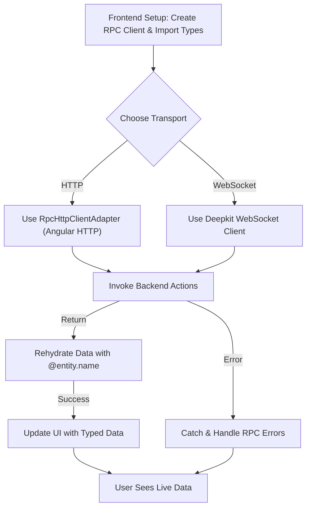

# Integrating with Frontend Frameworks

Deepkit Framework enables a seamless connection between your backend and popular frontend frameworks such as Angular and Remix. Leveraging Deepkit RPC and HTTP APIs, you can wire up clients efficiently, establish robust communication channels, and share types across the stack for true end-to-end type safety.

This guide walks you through integrating Deepkit with frontend frameworks, focusing on client setup, communication strategies, and best practices for maintaining type consistency.

---

## Workflow Overview

- **Task Description:** Learn to connect your Deepkit backend with frontend frameworks using RPC and HTTP to enable typesafe real-time communication.
- **Prerequisites:** 
  - A working Deepkit backend exposing RPC or HTTP controllers.
  - Basic knowledge of your frontend framework (Angular, Remix).
  - Shared TypeScript types or packages for your data models and controller interfaces.
- **Expected Outcome:** 
  - A frontend client able to invoke backend RPC methods or HTTP endpoints.
  - Shared types ensuring compile-time safety and runtime validation.
  - Understanding of wiring communication channels for HTTP and WebSocket transports.
- **Time Estimate:** 15–30 minutes
- **Difficulty Level:** Intermediate

---

## Step-by-Step Integration Guide

### 1. Prepare Shared Types for Isomorphic Use

To achieve end-to-end type safety, isolate your data models and RPC interfaces in a shared TypeScript package or folder. This package should be imported by both backend and frontend:

```typescript
// shared/user.ts
import { entity } from '@deepkit/type';

@entity.name('user')
export class User {
  id!: number;
  username!: string;
}

// shared/controller.ts
export interface MainController {
  getUser(id: number): Promise<User>;
}
```

This setup allows the client and server to use exact same types for parameters and return values.


### 2. Setup an RPC Client in Your Frontend

Depending on your frontend technology and transport choice, initialize an RPC client pointing to your backend.

#### Angular Example

Angular applications benefit from Dependency Injection to provide and reuse the RPC client.

Add providers to `app.config.ts`:

```typescript
import { RpcClient, RpcHttpClientAdapter, RpcHttpHeaderNames } from '@deepkit/rpc';
import { APIInterceptor, ControllerClient, RpcAngularHttpAdapter } from './client';

export const appConfig = {
  providers: [
    ControllerClient,
    RpcAngularHttpAdapter,
    {
      provide: RpcClient,
      deps: [RpcAngularHttpAdapter],
      useFactory: (http: RpcAngularHttpAdapter) => new RpcClient(new RpcHttpClientAdapter('api/v1', {}, http)),
    },
    {
      provide: HTTP_INTERCEPTORS,
      useClass: APIInterceptor,
      multi: true
    },
  ]
};
```

Create a service to wrap the RPC controller:

```typescript
import { Injectable } from '@angular/core';
import { RpcClient } from '@deepkit/rpc';
import type { MainController } from '../shared/controller';

@Injectable({ providedIn: 'root' })
export class ControllerClient {
  main = this.client.controller<MainController>('main');

  constructor(private client: RpcClient) {}
}
```

Use `ControllerClient` anywhere via injection to call backend methods strongly typed.


#### Remix or Other Frameworks

For Remix or frameworks without Angular-like DI, manually create an RPC client instance:

```typescript
import { DeepkitClient } from '@deepkit/rpc';
import type { MainController } from '../shared/controller';

const client = new DeepkitClient('ws://localhost:8081'); // or HTTP endpoint
const mainController = client.controller<MainController>('main');

// Usage
(async () => {
  const user = await mainController.getUser(42);
  console.log(user.username);
})();
```

Make sure to use the correct transport protocol supported by your frontend and backend.


### 3. Communication Channels: HTTP vs. WebSocket

Deepkit RPC supports multiple transports aligned with frontend capabilities:

- **HTTP:** 
  - Suitable for typical request/response interactions.
  - Works well in server-rendered or RESTful environments.
  - Commonly used with the `RpcHttpClientAdapter` in Angular.

- **WebSocket:**
  - Enables full-duplex persistent connections.
  - Supports real-time streaming with RxJS Observables.
  - Preferred for live updates like chats or sensor data.

Choose the transport based on the app’s interactivity needs:

- For Angular + HTTP, use `RpcHttpClientAdapter` and Angular HttpClient.
- For Angular + WebSocket or modern frontend, use `DeepkitClient` or `RpcWebSocketClient`.


### 4. Share and Register Nominal Types on Both Frontend and Backend

To preserve class identity and methods when deserializing data on the client, mark your model classes with `@entity.name` decorator with a unique string ID.

```typescript
// shared/user.ts
import { entity } from '@deepkit/type';

@entity.name('user')
export class User {
  id!: number;
  username!: string;

  get displayName() {
    return this.username.toUpperCase();
  }
}
```

Both client and server must import the exact same `User` class to ensure `instanceof User` works correctly. This enables full object rehydration over RPC.


### 5. Calling Backend Actions in Frontend

From your frontend, you can call the controller's actions just like local methods. Each call returns a Promise.

```typescript
const user = await mainController.getUser(1);
console.log(user.displayName);
```

If your action returns a stream (RxJS Observable), subscribe to receive updates:

```typescript
const sensorData = await mainController.sensorData();
const subscription = sensorData.subscribe(data => {
  console.log('Sensor data:', data);
});

// later
subscription.unsubscribe();
```


### 6. Handling Errors with Type Safety

Errors thrown on the backend are automatically serialized and forwarded to the client. You can catch errors and inspect details as usual.

```typescript
try {
  const data = await mainController.getSensorData('unknown');
} catch (error) {
  console.error('Error received:', error.message);
  // Custom error handling
}
```

Use custom error classes for richer error information.

### 7. Best Practices & Tips

- **Centralize shared types in a dedicated package or folder** for true isomorphic TypeScript.
- **Use nominal type registration (`@entity.name`)** to maintain class identities and methods on the client.
- **Choose transports based on app needs:** use HTTP for simple RESTful calls, WebSockets for real-time updates.
- **Leverage Angular DI providers** for clean integration and easier testing.
- **Monitor connection states and handle reconnection** in your client code to ensure robustness.

---

## Troubleshooting & Tips

<AccordionGroup title="Common Issues and Solutions">
<Accordion title="Connection Failures">
- Verify correct transport protocols (HTTP vs WebSocket) and URLs.
- For browser clients, WebSocket URLs should start with `ws://` or `wss://`.
- Ensure CORS and firewall settings allow frontend-backend communication.
</Accordion>
<Accordion title="Type Mismatches or Serialization Errors">
- Confirm both client and server import and use the exact same shared types.
- Make sure all model classes are decorated with `@entity.name`.
- Check that TypeScript types are explicit and not inferred.
</Accordion>
<Accordion title="Streaming Data Does Not Update">
- Ensure client subscriptions to Observables are active.
- Verify server returns RxJS Observables or Subjects.
- Use `.unsubscribe()` carefully; unsubscribing stops server-side streaming.
</Accordion>
<Accordion title="HTTP Adapter Issues in Angular">
- Ensure `APIInterceptor` sets correct base URLs.
- Verify `RpcAngularHttpAdapter` is provided in the module.
- Check Angular HttpClient module imports are properly configured.
</Accordion>
</AccordionGroup>

---

## Next Steps & Related Documentation

- [Deepkit RPC Getting Started](../rpc/getting-started.md) — Setup and basic usage of Deepkit RPC.
- [Building Real-Time RPC APIs](../real-time-apis-and-integrations/building-rpc-apis.md) — How to develop streaming enabled RPC backend APIs.
- [Dependency Injection](../rpc/dependency-injection.md) — Understand DI for controller management.
- [Integrating with Databases](../real-time-apis-and-integrations/database-integration.md) — Combine RPC with database access.
- [Creating Your First Deepkit App](../../guides/getting-started/create-new-app.md) — Comprehensive getting started guide.
- [Configuration Basics](../../getting-started/first-app-setup/configuration-basics.md) — Manage app settings and environment.

---

## Summary Diagram: Frontend Integration Workflow


