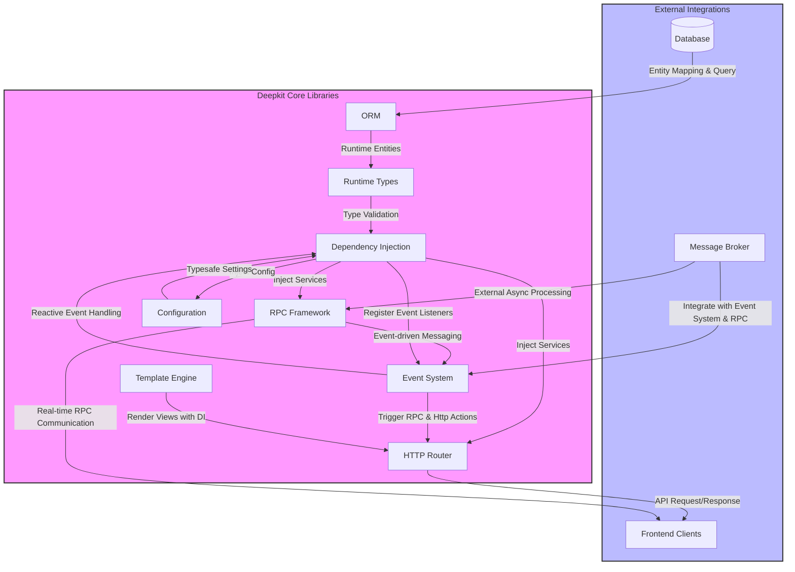

# System Architecture Overview

Explore a high-level architectural map of Deepkit Framework, illustrating how its modular components, data flow patterns, and core integrations work together seamlessly to deliver efficient, real-time applications. This documentation walks you through Deepkit’s key building blocks and their interactions with clear Mermaid diagrams to visualize the framework’s structure.

---

## Overview

Deepkit Framework is designed as a unified, modular TypeScript platform for enterprise applications, combining backend libraries with tooling for the full stack. Understanding its system architecture is essential to harness its power effectively.

This page shows how Deepkit's core libraries and services interoperate, enabling fast development and high runtime performance through carefully organized modules and scalable patterns.

---

## Core Architecture Explained

At its heart, Deepkit Framework leverages modularity to align reusable libraries—ORM, RPC, HTTP routing, event systems, dependency injection, configuration, and more—into a cohesive ecosystem. Each component is purpose-built yet designed to interconnect naturally.

This architectural approach ensures:

- **Scalability:** Independent modules can evolve or be replaced without breaking the system.
- **Efficiency:** Shared data types and runtime validation reduce redundancy and errors.
- **Reusability:** Code, models, and services extend uniformly throughout backend and frontend.
- **Real-time capabilities:** The event-driven and RPC frameworks enable responsive communication patterns.

### The Building Blocks

| Component               | Role & Responsibility                                     |
|-------------------------|-----------------------------------------------------------|
| ORM                     | High-performance object-relational mapping supporting SQL and NoSQL databases.
| Runtime Types           | Centralized type system supporting validation, serialization, and reflection at runtime.
| HTTP Router             | Declarative routing with automatic input deserialization and validation.
| RPC Framework           | Type-safe remote procedure calls enabling WebSocket and TCP integrations.
| Dependency Injection    | Powerful auto-wiring container for services, controllers, and commands.
| Event System            | Reactive event-driven architecture supporting asynchronous workflows.
| Configuration Management| Typesafe configuration loading and injection.
| Template Engine         | JSX-based high-performance template renderer with DI support.

These components form the backbone, seamlessly working together, with a shared focus on runtime type safety and developer productivity.

---

## Data Flow and Integration

Deepkit’s architecture fosters smooth data flow across layers, from the database through service logic to API endpoints and frontend clients.

### Typical Flow Example:

1. **Database Layer:** Entities defined via Runtime Types map directly to database tables using the ORM, guaranteeing consistency.
2. **Business Logic:** Services handle data manipulation, injected automatically via Dependency Injection.
3. **API Layer:** HTTP and RPC controllers expose functionality with validated, typed inputs and outputs.
4. **Client Interaction:** Clients invoke RPC endpoints or HTTP routes with confidence, benefitting from consistent serialization and error handling.

This uniform typing and validation pipeline drastically reduces bugs, enhances maintainability, and accelerates feature delivery.

---

## Visualizing the Architecture

The following Mermaid.js flowchart provides a high-level view of Deepkit’s core modules and their interactions:

---

## Practical Benefits of This Architecture

**For developers and teams working with Deepkit, this architecture means:**

- Minimizing boilerplate through shared runtime types and dependency injection.
- Enabling true end-to-end typesafety from database to frontend.
- Supporting real-time features with native event and RPC frameworks.
- Streamlining integration of external systems like message queues and databases.
- Offering straightforward extensibility through decoupled, modular libraries.

By understanding the system layout here, you gain insight into where to extend, debug, or optimize your applications built with Deepkit.

---

## Tips for Navigating the Architecture

- Start defining your core data models using **Runtime Types**, ensuring type safety.
- Use **ORM** for database access; it’s optimized for speed and supports multiple databases.
- Lean on **Dependency Injection** to manage service dependencies cleanly and testably.
- Expose functionality via **HTTP Routers** or **RPC Controllers** depending on your use case.
- Use the **Event System** to react to internal or external triggers asynchronously.
- Configure your app globally with **Configuration Management**, injected wherever needed.
- Use the **Template Engine** for rendering, taking advantage of direct DI access.

---

## Troubleshooting Common Architectural Challenges

<AccordionGroup title="Troubleshooting Architecture Issues">
<Accordion title="Module Dependency Conflicts">
Ensure all modules declare their dependencies explicitly through DI. Circular dependencies can cause injection failures or runtime errors.
</Accordion>
<Accordion title="Runtime Type Validation Errors">
Verify that your runtime types align exactly with your database schema and serialized data to avoid validation errors in service layers.
</Accordion>
<Accordion title="Unexpected Event Processing Behavior">
Check event handlers for async behavior and ensure events aren’t unintentionally consumed or duplicated.
</Accordion>
<Accordion title="Performance Bottlenecks in RPC or ORM">
Use Deepkit Profiler to trace slow queries or blocking calls, then optimize entity relations or RPC payloads.
</Accordion>
</AccordionGroup>

---

## Next Steps

- Dive into the [Core Concepts & Terminology](/overview/architecture-core-concepts/core-concepts) to deepen your understanding of building blocks.
- Explore the [Feature Map at a Glance](/overview/architecture-core-concepts/feature-overview) for an overview of key capabilities.
- Visit the [Deepkit Libraries & Ecosystem](/overview/integration-and-ecosystem/ecosystem-libraries) page to learn how other libraries fit into this architecture.

Understanding this architectural foundation empowers you to build scalable, maintainable, and performant TypeScript applications with Deepkit Framework.

---

*For comprehensive hands-on implementation, refer to guides on dependency injection, HTTP routing, and RPC API development within the documentation.*
