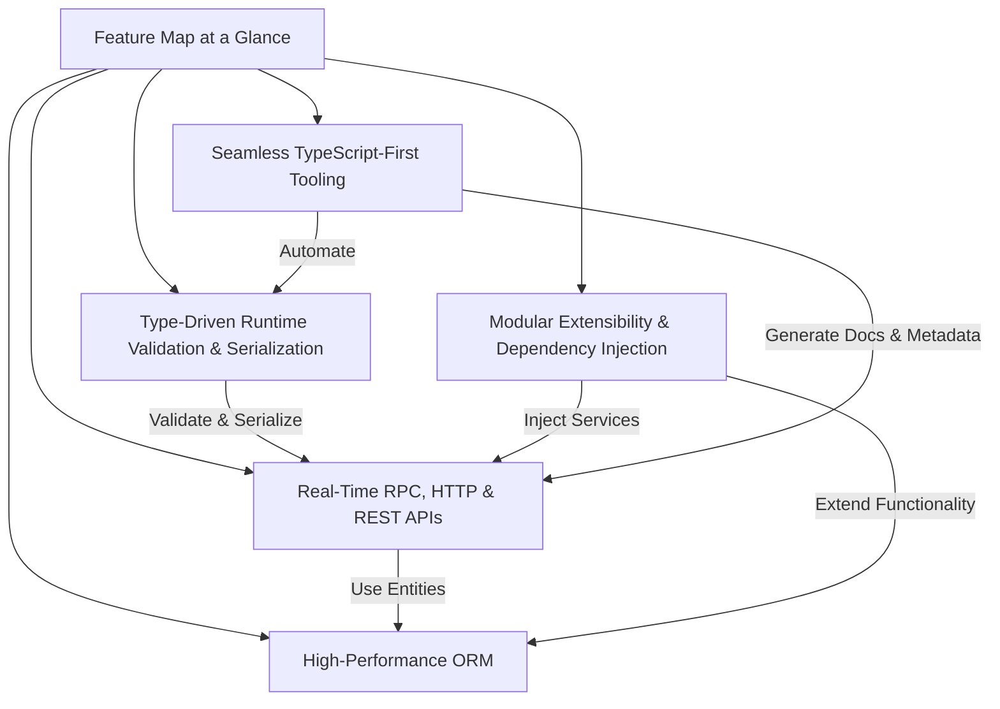

# Feature Map at a Glance

Deepkit Framework brings a versatile suite of powerful, TypeScript-first features designed to accelerate enterprise application development while ensuring robustness, scalability, and real-time responsiveness. This page offers a concise survey of Deepkit’s flagship capabilities, empowering you to quickly understand its scope and the unique benefits it delivers.

---

## Unlocking Deepkit’s Core Strengths

Dive into the hallmark features that define the Deepkit Framework. Each feature is designed to solve specific development challenges and unlock new possibilities for TypeScript developers building modern applications.

### 1. Type-Driven Runtime Validation and Serialization

Deepkit’s runtime type system goes beyond compile-time checks. It enables automatic, high-performance validation and serialization of complex data structures based on TypeScript types.

- Eliminate boilerplate validation code
- Guarantee strict type consistency between client and server
- Enable seamless data transformations and serialization

*Example:* When an API request arrives, Deepkit validates the payload against your declared types automatically, ensuring only valid data proceeds through your application.

### 2. Real-Time RPC, HTTP & REST APIs

Construct flexible APIs with minimal overhead supporting multiple protocols:

- **RPC:** Type-safe method calls that feel like local function invocations
- **HTTP & REST:** Conventional and REST-compliant endpoints with powerful routing
- **Real-Time Support:** Built-in support for live updates and bidirectional communication

*Example:* Build a chat app where the backend pushes updates to clients asynchronously, all while benefiting from typed method signatures.

### 3. High-Performance ORM

Deepkit ORM provides a seamless, type-safe database layer crafted for speed and reliability:

- Support for complex relations, migrations, and query optimizations
- Type inference from your entities to prevent runtime surprises
- Designed for enterprise-scale workloads

*Example:* Change your data model and have the ORM assist with type safety across queries and transactions instantly.

### 4. Modular Extensibility and Dependency Injection

Compose your app from modular features with powerful DI:

- Self-contained modules encapsulate functionality and configuration
- Dependency Injection links service lifecycles cleanly and predictably
- Enables easy testing, isolation, and extension

*Example:* Add a new authentication module that integrates effortlessly with existing controllers, services, and event handlers.

### 5. Seamless TypeScript-First Tooling

Maximize DX with tooling designed to complement TypeScript’s strengths:

- Compiler integration for error detection and inference
- Rich metadata extraction to automate routing and API discovery
- Strong tooling ecosystem support minimizing manual wiring

*Example:* Generate accurate API documentation automatically from your controllers and types.

---

## How This Page Fits in Your Documentation Journey

This feature overview succinctly introduces you to the capabilities you can leverage throughout your Deepkit projects. By understanding this map, you can approach deeper technical topics such as architecture, core concepts, and integration guides with clear context on what capabilities are available and how they interrelate.

- For a deeper dive into how these features integrate, see the [System Architecture Overview](/overview/architecture-core-concepts/architecture-diagram).
- To understand the foundational concepts underpinning these features, read [Core Concepts & Terminology](/overview/architecture-core-concepts/core-concepts).

---

## Real-World Impact: Why This Matters

Adopting Deepkit Framework’s features delivers tangible benefits that transform your development process and application quality:

- **Speed:** Drastically reduce coding time by automating validation, serialization, and API routing.
- **Reliability:** Catch bugs early with runtime validation and type safety extending through your app layers.
- **Flexibility:** Switch between protocols (RPC, HTTP, REST) effortlessly without rewriting business logic.
- **Scalability:** Design modular, maintainable systems ready for enterprise demands.

*Scenario:* Imagine integrating a new payment service. With Deepkit, you model your payment entities once, and the runtime validation, API endpoints, and ORM integration all come from that single source of truth — no duplicated effort, fewer errors, faster deployment.

---

## Quick Getting Started Preview

Ready to harness these features?

1. **Explore the [Getting Started](/getting-started/prerequisites-installation) guides** to set up your environment.
2. **Follow the [Creating Your First Deepkit App](/getting-started/first-app-setup/creating-your-first-app) tutorial** to build, run, and validate your first project.
3. **Dive into specific features** like runtime types, RPC, and ORM through the in-depth concepts and API reference sections.

This page serves as your gateway to mastering Deepkit Framework’s rich capabilities.

---

## Visual Overview

---

Remember, this page is your quick navigational snapshot to identify capabilities and understand their role. Use it as a compass to orient your learning and project design with Deepkit Framework.

Explore the detailed documentation pages next to gain technical mastery and start building powerful TypeScript applications today.
